# FLUID POWER SYMBOLS REVIEW

## Correctly Identify The Following Symbols

1. 
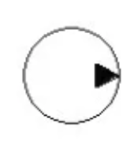
***

2. 
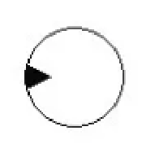
***

3. 
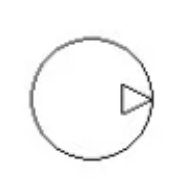
***

4. 
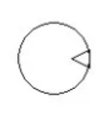
***

5.  
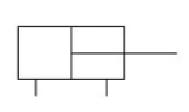
***

6. 
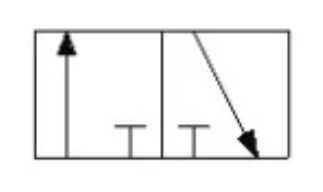
***

7. 
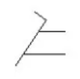
***

8. 
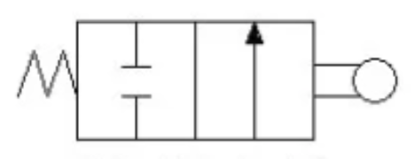
***

9. 
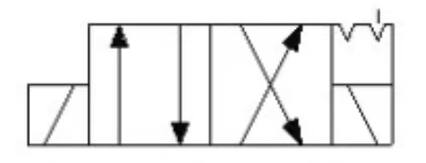
***

10. 
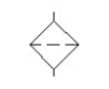
***

11. 
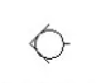
***

12. 
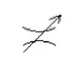
***

13. 
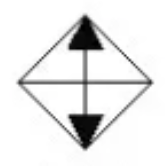
***

14. 
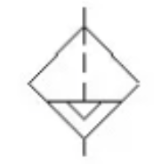
