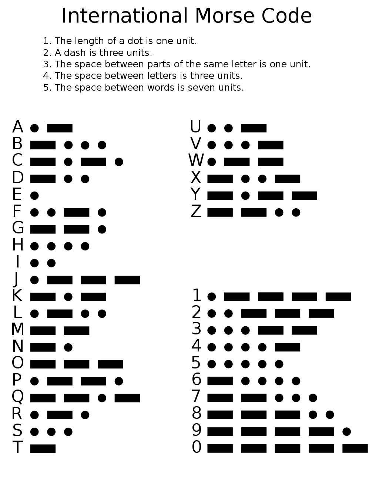

# MORSE CODE

We will use the following translation for our programming:

- The length of a single dot is one unit, represented by **1 OUTPUT LED**
- A dash is three units, represented by **3 OUTPUT LEDs**
- The space between parts of the same letter is one unit

## PARAMETERS:
- Only 1 letter will be "on screen" at a time (first 16 bits)
- Next letter won't start until the last is pushed "off screen"
- There will not be whole words on the I/O, only single letters that stream

## REFERENCE

[Morse Code on Wikipedia](https://en.wikipedia.org/wiki/Morse_code)

