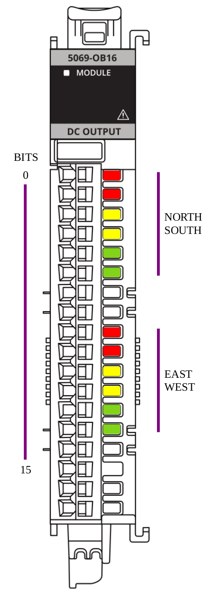
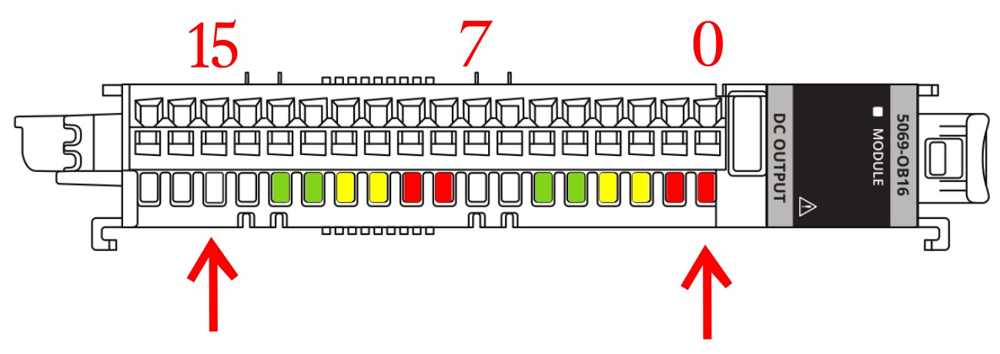

# SEQUENCER TRAFFIC SKETCH

## OUTPUT MODULE
- Think about the module laying on its side
- The CONTROL tag is the key
- Use the ".POS" as your step

## DRAWING BOARD

- Rotated 90-deg clockwise
- When Horizontal, bit 0 and bit 15 line up
