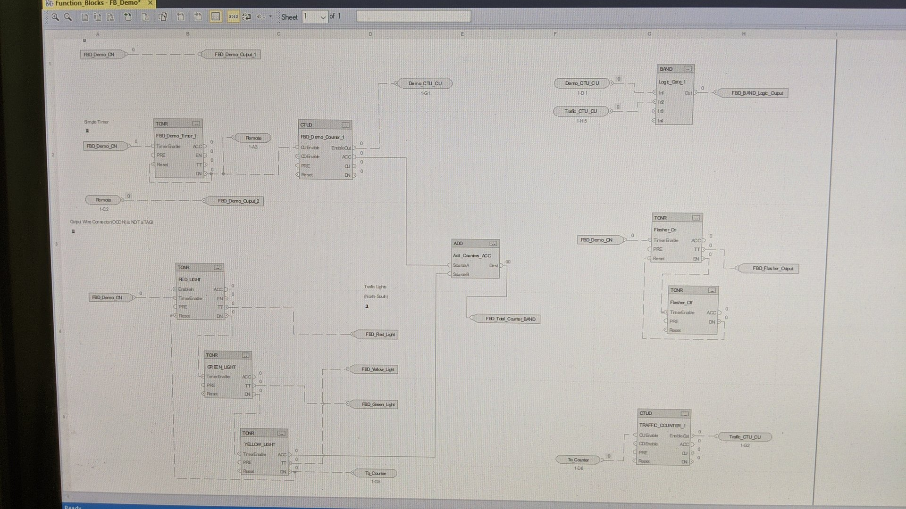

# TRAFFIC - FUNCTION BLOCK DIAGRAM (FBD)

- Create a 4-way Traffic routine using FBD
- Include stop/start controls on the HMI
- Include lights for all directions

## PARAMETERS

- All RED lights: 10 seconds 
- All YELLOW lights: 3 seconds 
- All GREEN lights: 7 seconds

## NOTES:

- Once started, the routine must continually loop 
- The light sequence must follow the common logical sequence 
- Do not create a traffic jam or motor vehicle accident! 

_This does not have to be an LCARS-style interface. Use your own imagination!_
