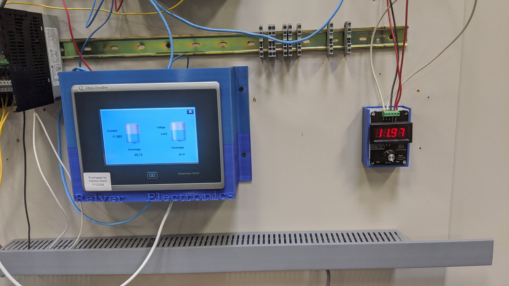

# Tank Level Signal Generator

>SEE THE ANALOG INPUT PDF FOR PROPER WIRING

Create a simple HMI Tank Level simulation using the following components:
- Analog Input module 
- Voltage Signal Generator (0-10 v) 
- Current Signal Generator (4-20 mA) 
 
## PARAMETERS
- Display (2) tank levels on the HMI screen 
- Tank 1 level is controlled by VOLTAGE 
- Tank 2 level is controlled by AMPERAGE 
- Display voltage or amperage along side each tank, respectively 
- Additionally, display the level for each tank as a PERCENTAGE 

## REMEMBER
- Changes under MODULE PROPERTIES > SCALING > ENGINEERING UNITS are entered manually! 
- Write in "mA" or "%" as needed to get the proper output tag format. 
- Don't forget to use REALS for floating decimal points. 