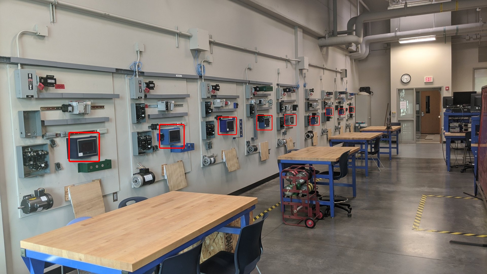

# WALL RUN II

## HMI SEQUENCE:

- Use a BLUE background for each HMI
    - Choose a blue that is close to school colors
    - All HMIs must use the same color
- Use WHITE letters for the word or phrase
    - Letters must be scaled up as large as possible for best viewing
    - Use the same font for each; don't mix and match!
- Scroll the phrase across each HMI screen, down the full length of the lab, one letter at a time
    - Adjust timing for best effect 
- When all HMIs are filled, flash all letters on/off
    - Repeat 3 times
- Start sequence again

## PARAMETERS:

- Can use Prod/Con tags or MSG instruction (all global/controller scope)
    - _Don’t even attempt to “synchronize” the operation using TON/TOF timers_
- Use Properties, State Tables and/or Color Tables, as needed
- Must have 1 start/stop screen only (at the far end of the lab)
- Must use all PLC/HMI combos
    - _if wiring is required, power down the equipment and make it happen!_

## SIMPLE CONFIG:

If time doesn't permit...

- Flash individual screens from dark > bright > dark, down the wall and back again (“bounce”)
    - bright interval: 0.5 seconds
- Fill and clear screens in sequence, down and back (“snake”)
    - 1.0 second interval
