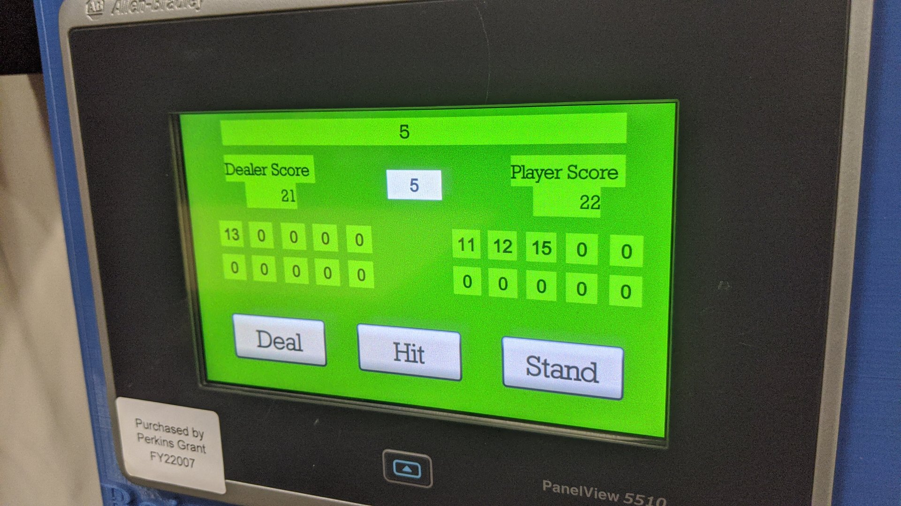
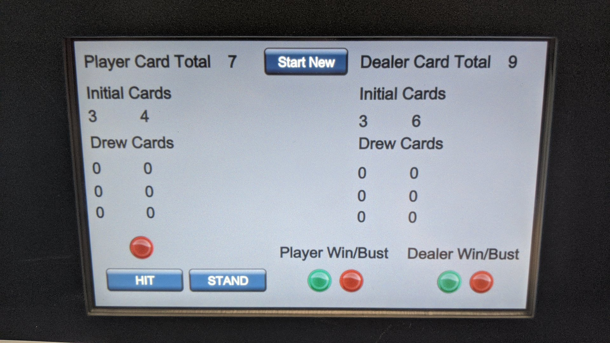

# PROJECT: BLACKJACK

## RULES OF THE GAME
Using any and all instructions, create a PLC/HMI routine to play the card game "Blackjack"
- Inputs to deal the initial hand of cards 
    - Dealer's initial cards: 2 cards up (visible) 
    - Player's initial cards: 2 cards up (visible) 
- Input/logic to deal additional cards for the Player ("hit me!") 
- Input/logic for the Player to "stand" on their hand 
- Logic for the Dealer to draw/receive additional cards 
    - _Must be done even if the Player already went bust!_
- Logic for the Dealer to stand/hold on on a **17** or higher 
- Logic to "bust" both Dealer and Player if they exceed **21**
- Logic for a "win" if the Player beats the Dealer under **21** 
- Logic for a "win" if Dealer or Player equal **21** 
- Logic to "push" if both Dealer and Player cards are equal to each other without "busting" 
- Tracking the number of games played 
- Tracking the number of Player wins/losses 
- Input to reset and play another hand (after 1 hand is complete) 
 
## NOTE:
- An interactive HMI is required to play this game.
    - _The HMI does not have to be in the LCARS-style_
- Start with numerical information/displays to work out the logic.
    - _I recommend you do this first_
- Display must shows **ALL** card values dealt (Player & Dealer), not just the total sum. 
- If time allows, include graphics for all cards! 
 
## PARAMETERS:
- Card deals must be random and NOT pre-programmed sequences!
- Number card values: 2-10 
- Face card (Jack, Queen, King) value: 10 
- Ace value: 1 or 11
    - _This is tricky because the PLC needs to know how you want to play an Ace_
- IGNORE any rules related to betting, splitting, doubling-down, insurance or settlement. 
    - _Just play the game without all the noise!_ 
 
## RNG:
- An example of Random Number Generator (RNG) code is in my Homebrew
    - _I will allow for coding multiple decks in the Dealer's Shoe_
- Link: [Dealer's Shoe](https://en.wikipedia.org/wiki/Shoe_(cards))

## EXAMPLE HMI:

Example 1

Example 2

