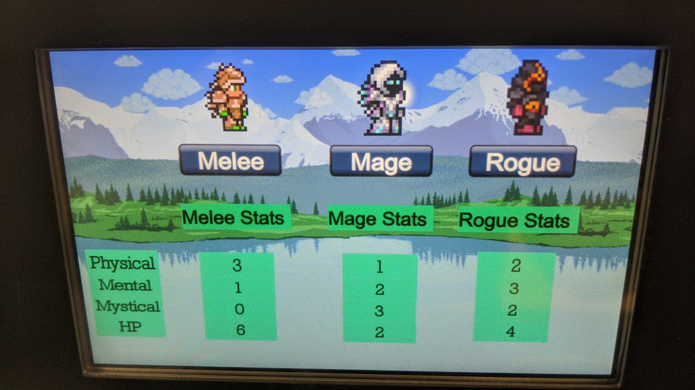
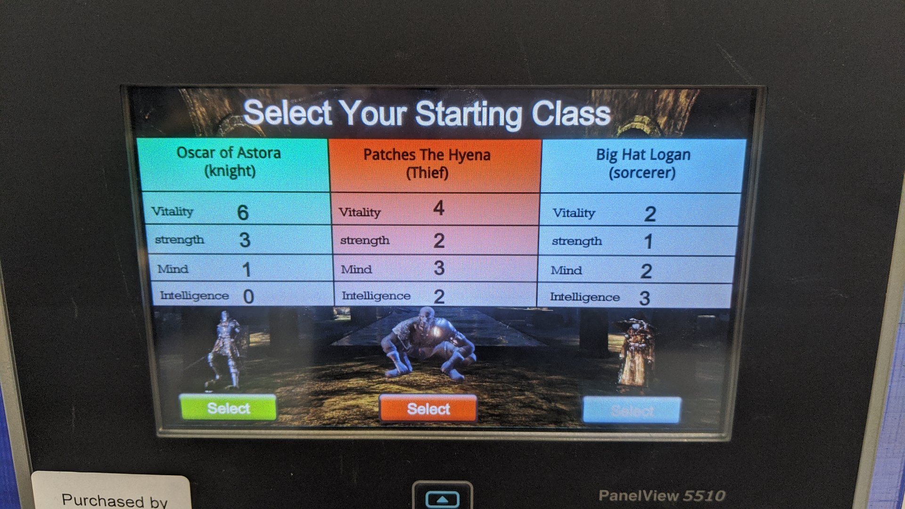
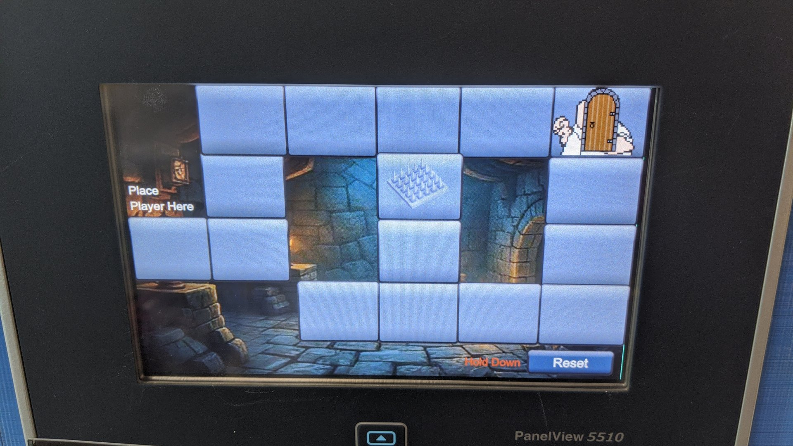
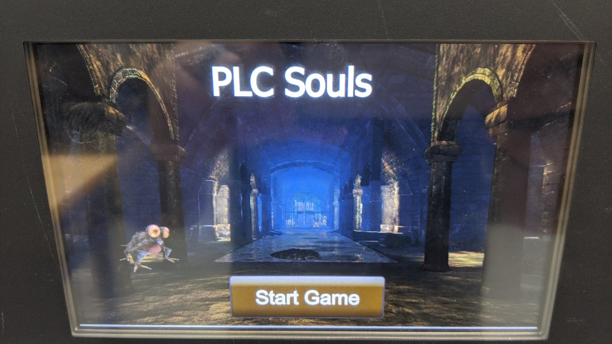
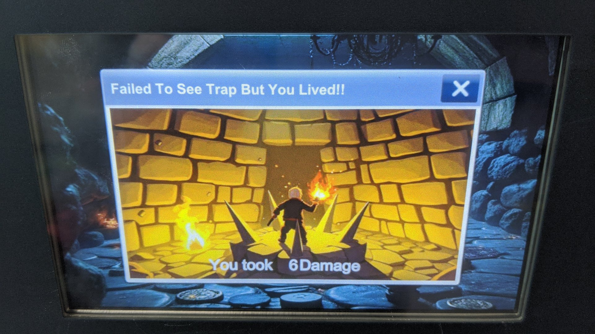
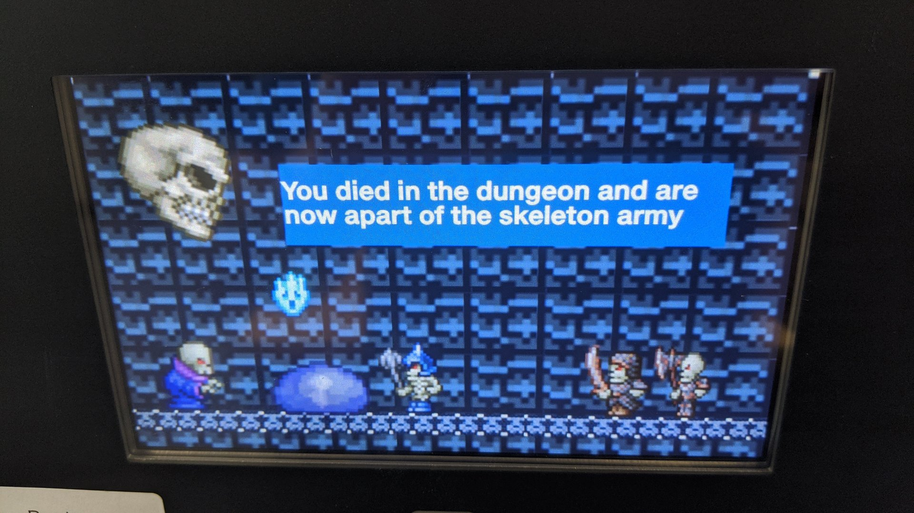

# PROJECT: DUNGEON CRAWL

**WHAT:** Simulate a dungeon crawl gaming experience using PLC and HMI lab equipment.

**WHY:** To simulate the complexity of a large scale, data management scenario common to modern manufacturing environments.

### EXAMPLE DEMONSTRATION

## THE OBJECTIVE

To enter, navigate and exit the dungeon before reaching zero Hit Points.
- _There is valuable loot at the far end of the dungeon!_ :gem:

## GAME RULES

### RANDOM NUMBER GENERATORS (RNG)

Use logic to create RNG for the following dice rolls:
- :game_die: 1d20 for your **Initiative** and normal **Actions**.
- :game_die: 1d6 for your **Melee Attack Damage**.
- :game_die: :game_die: 2d6 for your **Spell Damage**. 
    - Enemies have a fixed damage value. No RNG needed. 
    - You may automate your Damage roll RNG on a successful hit, so you don't have to click an additional damage button. 
    - You may **not** automate the player Attack rolls. If you did that, then YOU aren't really the game; the PLC is just playing with itself! 
 
 
 
### ACTION ECONOMY

Everyone gets ONE Action on their Turn:
- Roll 1d20 + relevant Stat + Bonus (if any) vs DC 
    - If your total is equal to or greater than the DC, you **SUCCEED** with the Action. 
    - If your total is less than the DC, you **FAIL** at the Action. 

## CHARACTER CREATION

Create an interface for Player Class selection based on the following three choices:

- Fighter :crossed_swords:
- Rogue :dagger:
- Wizard :fire:

Use navigation and popup screens as needed

## CHARACTER STATS

Based on Player input, allocate the following data to each Class:

1. Character Name (needs a **$String** to enter your character name?) 
2. Class type selected
3. Physical stat (for attacks) 
4. Mental stat (for lock-picking/trap disarming) 
5. Mystical stat (for Spell casting) 
6. Hit Points (HP) 

### STAT REFERENCE TABLE

| **CHARACTER'S NAME**  | **CLASS** | **PHYSICAL** | **MENTAL** | **MYSTICAL** | **HP** |
| --------------------- | --------- | :----------: | :--------: | :----------: | :----: |
| _Requires user input_ | Fighter   |      3       |     1      |      0       |   6    |
| _Requires user input_ | Rogue     |      2       |     3      |      2       |   4    |
| _Requires user input_ | Wizard    |      1       |     2      |      3       |   2    |

### CHARACTER SELECTION SCREEN EXAMPLE 1

### CHARACTER SELECTION SCREEN EXAMPLE 2

## CHARACTER INVENTORY

Based on Player input, allocate the following data to each Class:

**THE FIGHTER**
- :crossed_swords: Sword stat (+2 bonus to attack, 1d6 dmg)

**THE ROGUE**
- :dagger: Dagger stat (no attack bonus, 1d6 dmg) 

**THE WIZARD**
- :fire: Spell (fireball, no bonus to attack, 2d6 dmg) 

## MAP & MOVEMENT

Navigate the dungeon terrain using an interactive map:
- Characters must be able to travel each square of the map.
- Characters may only move one square/tile at a time.
    - **No teleportation!**
- There will be no straight line dungeon maps!
    - Maps are like mazes, so plan accordingly.

### DUNGEON TILE EXAMPLE

## ENEMY LOGIC

Randomly Generated Creature (1-6) for Combat:
- Name/Type 
- Hit Points (HP) 
- Attack Damage (fixed value, no attack RNG) 

   
| **ROLL** | **ENEMY TYPE**        | **HP** | **DMG** |
| :------: | :-------------------- | :----: | :-----: |
|    1     | :robot: AI ROBOT      |   10   |    2    |
|    2     | :bear: MUTANT BEAR    |   8    |    2    |
|    3     | :dog: MUTANT DOG      |   4    |    1    |
|    4     | :snake: MUTANT SNAKE  |   4    |    1    |
|    5     | :spider: MUTANT SPIDER|   6    |    2    |
|    6     | :zombie: MUTANT ZOMBIE|   3    |    1    |

## COMBAT ENCOUNTER

When you land on a tile with an ENEMY creature...
 
**Roll for Initiative:**
- Roll 1d20 vs DC 12 (no stats, mods or bonuses)
    - Equal to or greater than the DC, the Character goes first. 
    - Less than the DC, the Enemy goes first! 
 
**Each side gets ONE Action:**
- Enemies will always ATTACK v. DC 15 (automated)
- Characters always have the option to leave on their turn.* 
- A normal Action in combat is 6 seconds in length. 
- This is good when automating the Enemy's turn, so the Player has time to see the Actions take place. 
 
**How are you going to defeat the enemy?**
- The :crossed_swords: FIGHTER will attack the enemy: Roll 1d20 + Physical stat + Bonus vs DC 15 
- The :dagger: ROGUE will attack the enemy: Roll 1d20 + Mental stat vs DC 15 
- The :fire: WIZARD will attack the enemy: Roll 1d20 + Mystical stat vs DC 15 

## ROLLED OUTCOMES

**:white_check_mark: ON A NORMAL ATTACK SUCCESS:**
- Roll for damage. Deduct damage from Enemy total HP.
- Continue with the encounter until one side is victorious. 

**:white_check_mark: ON A CRITICAL ATTACK SUCCESS (You roll a Natural 20):**
- Deal double damage. Deduct damage from Enemy total HP.
- Continue with the encounter until one side is victorious. 

**:white_check_mark: ON A CRITICAL DEFEND SUCCESS (Enemy rolls a Natural 1):**
- The Enemy flees and you are safe to proceed.

**:x: ON A CRITICAL ATTACK FAILURE (You roll a Natural 1):**
- You have dropped your weapon, dagger or burned out your spell.
- You have no options remaining except to flee the area and maybe return another day.* 

**:x: ON A NORMAL DEFEND FAILURE:**
- Suffer damage from the Enemy. Deduct damage from your HP.
- Continue with the encounter until one side is victorious. 

**:x: ON A CRITICAL DEFEND FAILURE (Enemy rolls a Natural 20):**
- Suffer double damage from the Enemy. Deduct damage from your HP.
- Continue with the encounter until one side is victorious. 

## :skull: AT 0 HP:

When a Player Character or Enemy Creature is reduced to zero Hit Points, they are vanquished!
- If the Character beats the Enemy in combat, then the Player is free to continue through the dungeon.
- If the Character is beaten by the Enemy during combat, then the Player must roll up a new character and try again.

## *DEV NOTE: 
You cannot proceed until an encounter is successfully completed. Have an option to exit the encounters, moving back the way you came. When you exit without a success, the encounter must be reset to start from the beginning, regardless of your initial progress. For a combat encounter, you must randomly generate a new creature.

## EXAMPLE HMI

## :moneybag: GRADING

This is a visual design project as much as it is a logic project. Take your time and create something visually stunning, because the aesthetics matter a great deal regarding your final grade.

- _I want WotC designers to weep with jealousy!_

## GAME EXAMPLES FOR INSPIRATION

Rogue-lite is a variation of the Rogue video game from the 1980's:

https://en.wikipedia.org/wiki/Rogue_(video_game)
 
Rogue-like games:

https://en.wikipedia.org/wiki/Roguelike
 
EXAMPLES of computerized (grid-based, pseudo-3D) RPG Dungeon Crawler games from the 70s-90:

https://youtu.be/g8FJi2jwsmg?si=XFLPlW3TXH4ZjZJb

https://youtu.be/GQgHSX2tof4?si=WCkMzTZZxa68seTR

## FINAL PROJECT NOTES
A PDF copy of all .ACD files (with YOUR name) will be provided to the instructor for review. Failure to produce a copy **before the deadline** will result in an automatic 0 for the entire assignment. No exceptions.
 
And remember, Chief will **almost always** play the game as a Wizard…

:game_die: _"IN GYGAX WE TRUST"_ :game_die:
