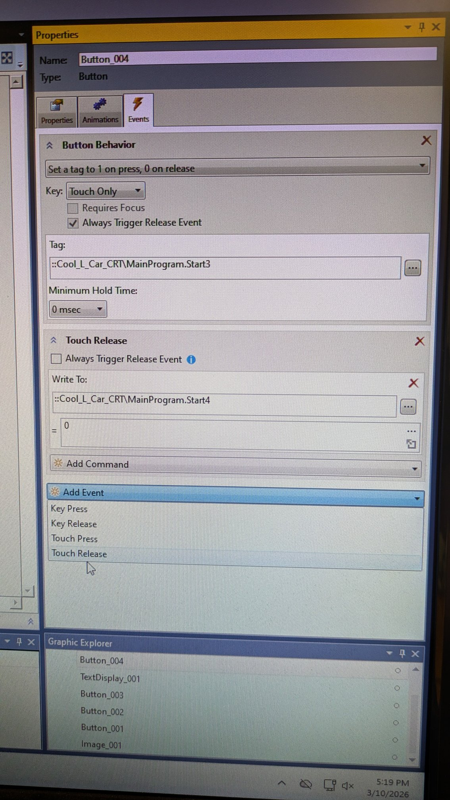

# MULTIPLE EVENTS FOR A SINGLE ELEMENT

- You can add multiple Events to an element
    - _I recommend using "**Touch Release**"_
- Use the last option at the bottom of the list called "**Value**"
- It has 3 options that may be of use

