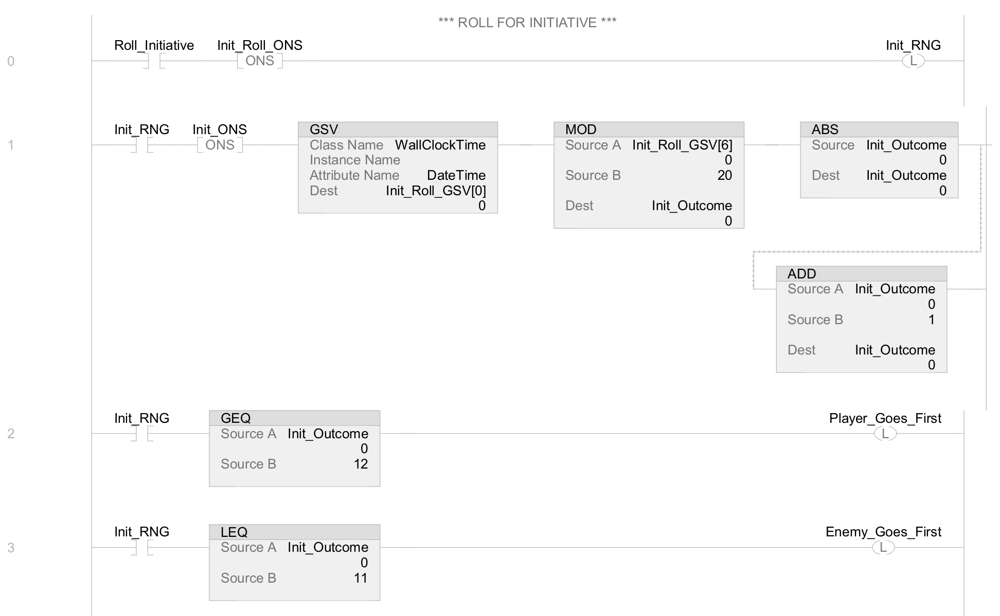

# RANDOM NUMBER GENERATOR (RNG) IN LADDER LOGIC (LD)

My workflow for Dungeons & Dragons dice generators:
- XIC to trigger the rung
- ONS to fire the GSV one time only
- GSV to capture WallClockTime in a DINT[7]
- MOD the DINT[6] element (microseconds) by 20 (for a twenty-sided die)
    - _This returns a value between 0-19_
- ABS to return only positive numbers
- ADD to add 1 to the returned value
    - _Because dice have no zeros on them!_
- Use GEQ and LEQ against a DC of 12
    - Meet or beat 12, the Player goes first!
    - Less than 12, the Enemy gets the first move.

**Side Note:** The -(L)- Latch instruction gets -(U)- later in the routine.
