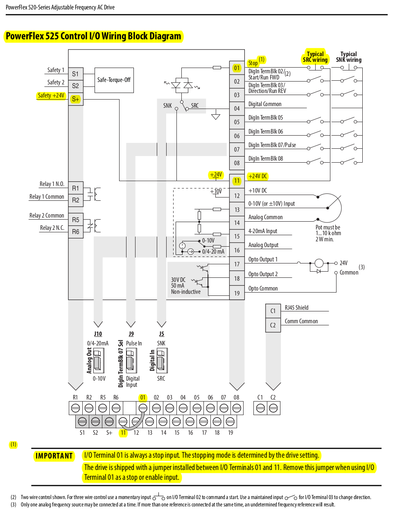
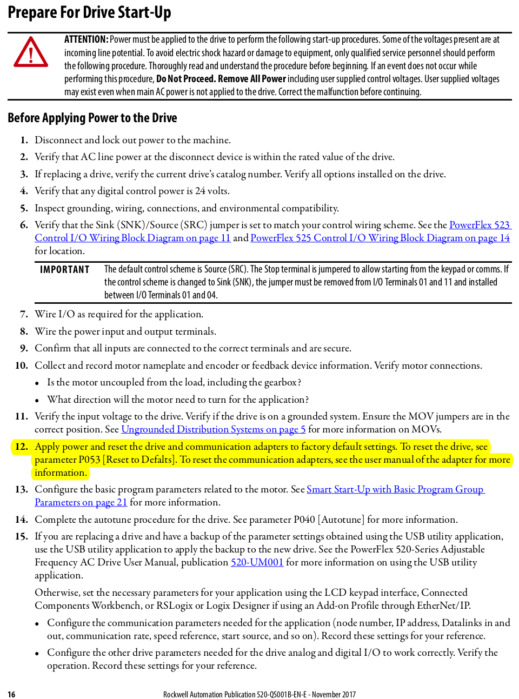
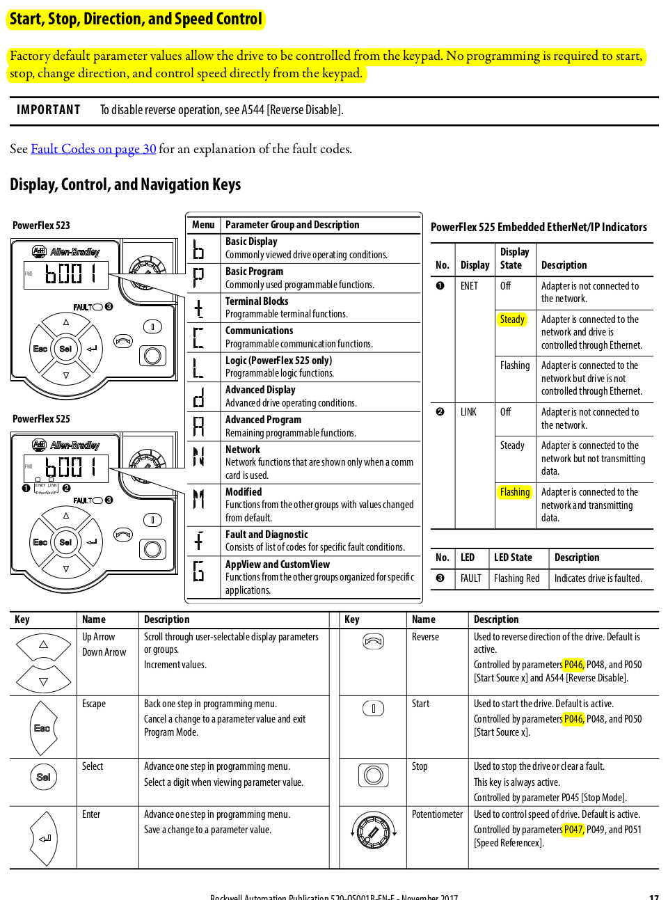
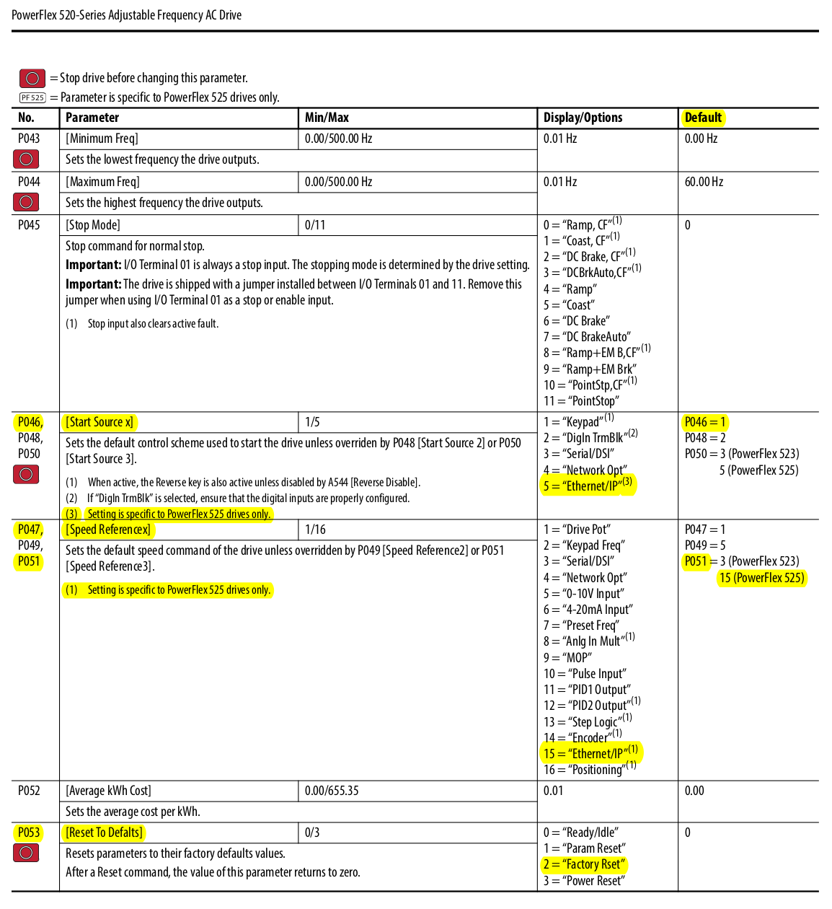
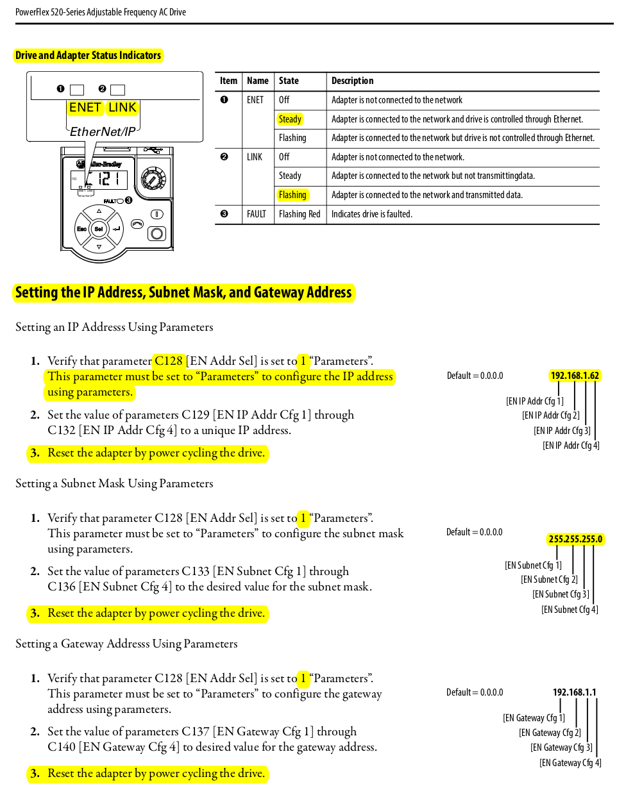

# POWERFLEX 525 QUICKSTART GUIDE

Link to PowerFlex 525 Quick Start PDF:
[PF525-Quick-Start](https://literature.rockwellautomation.com/idc/groups/literature/documents/qs/520-qs001_-en-e.pdf)

## PF525 WIRING

## PF525 OPERATIONS

## PF525 PARAMETERS

## PF525 IP ADDRESS SETUP

