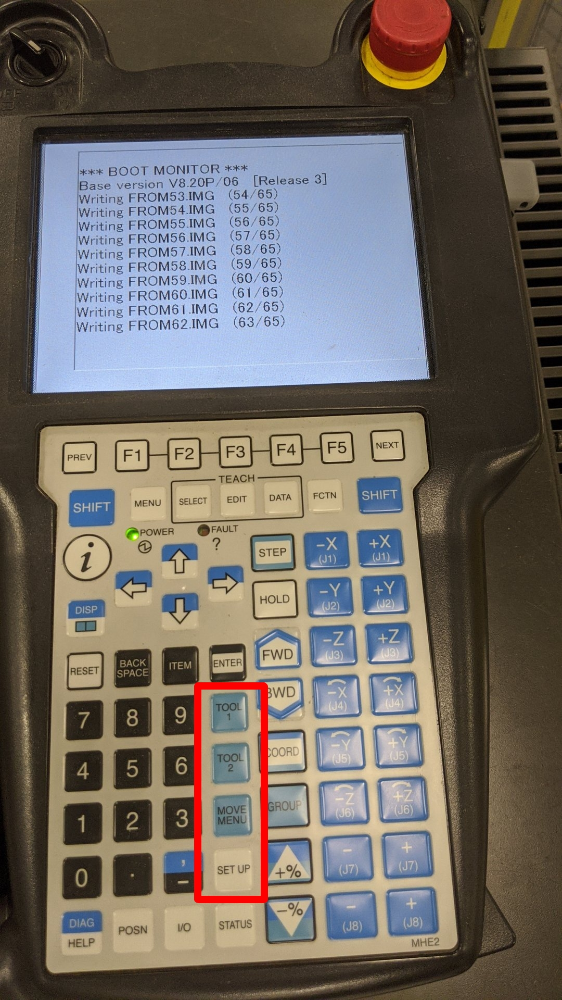

# MACRO BASICS (COUNTER | SAFE | READY)

We can use **Macros** to execute code without running an active program
- How many TP keys can we assign as custom Macros?
- What's the difference between:
    - **User Key - UK**
    - **Shift Key - SK**
- In the "**Group Mask**" field, what is the purpose of setting:
    - the number one (1)
    - or an asterisk (*)

## TASK
- Create (1) Macro to **count up** and store value in **REGISTER R**[1:Counter]
    - Bind count **up** macro to **TOOL 1**
- Create (1) Macro to **count down** and store value in **REGISTER R**[1:Counter]
    - Bind count **down** macro to **TOOL 2**
- Create (1) Macro to move the robot to a **SAFE POSITION**
    - Bind **safe** position macro to **MOVE MENU**
- Create (1) Macro to move the robot to the **READY POSITION**
    - Bind **ready** position macro to **SET UP**

## FOCUS
- **Binding programs** as Macros to TP soft keys

## BASIC PARAMETERS
- Set program **DETAILS** to:
    - "*" for logic
    - "1" for motion
- Properly assign the Macro programs to the TP soft keys
    - [MENU] > [SETUP] > [MACRO]
- Assign Macro routines to the appropriate [PROGRAM]
    - Assign "**UK 1**" to **Tool 1**
    - Assign “**UK 2**” to **Tool 2**
    - Assign “**SU 3**” to **Move Menu**
    - Assign “**SU 4**” to **Set Up**

## HARD-CODED COUNTER v1.0
- R[1: Counter] = R[1: Counter] **+** 1
- R[1: Counter] = R[1: Counter] **–** 1
    - _The constant **cannot be changed** when the program is running._

## SOFT-CODED COUNTER v2.0
- R[1: Counter] = R[1: Counter] **+** **R[2: Control]**
- R[1: Counter] = R[1: Counter] **–** **R[2: Control]**
    - _R[2:Control] **can** be changed when the program is running._

## READY POSITION BINDING
- Record the default **READY** position as a Macro and assign to TP key

## SAFE POSITION BINDING
- Record a **SAFE** position as a Macro and assign to TP key

>Use the macro keys to move the robot between positions.

---

# MAIN ROUTINE

Create a **Main Loop** program (properly formatted) that includes:
- **CALL** each macro to execute instructions
- **WAIT** for 3 seconds between each call

Test the operation of the program while using Split Screen for the Data page. 
Once completed, modify the **Main Routine**:
- Move the **WAIT** instruction to each individual Macro program
    - _This gives us time to see the screen change_
- Substitute the seconds interval with a REGISTER value
    - WAIT > ... sec > **INDIRECT** at the bottom > REGISTER

## VIDEO REFERENCE

- Macro-1
