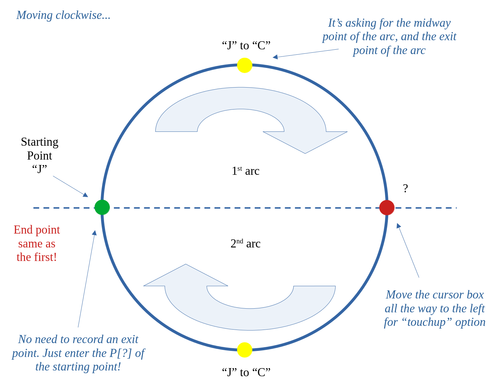

# CIRCLES FOR WELDING APPLICATION (POINTER)



## TASK
- Trace a circle around the end of a cylinder.
 
## WORLD-BUILDING PARAMETERS
- Fixture Model: "Table21”
- Part: Blue CYLINDER

## TEACH PENDANT / MENU PARAMETERS
- Coordinates: **WORLD**
- Active Frames: Tool Frame 1 & UserFrame 1
- **UFRAME 0** is "No Frame"

_If UTOOL or UFRAME causes and error ("Big Yella"), omit them both and move on!_

## SECTION SPECIFIC
```
!SETUP
- UTOOL_NUM = 1
- USERFRAME = 1
- OVERRIDE = 50%

!MAIN
LBL
- Record APPROACH point 100mm above the cylinder's starting point
- Record all needed CIRCULAR points
    - C P[] 250mm/sec FINE
JMP LBL

!ERRORS
- Remark & Label only. No code needed.
 
!END OF LINE
- Remark & Label only. No code needed.
```

**QUESTIONS**
- _Notice the pause between each arc?_
- _How can we eliminate the pause?_
    - _Change 1st point on Circle to LINEAR 250mm/sec **CNT100** ?_


## LAB PARAMETERS
- Properly configured **Gripper MACROS** (Tool 1 & Tool 2) are required to hold the Pointer
- Verify the UTOOL_NUM is properly entered for your Robot

## FUTURE CODING PARAMETERS
- Include a Position Register Offset for the Z coordinate?

## VIDEO REFERENCE
- Circles
