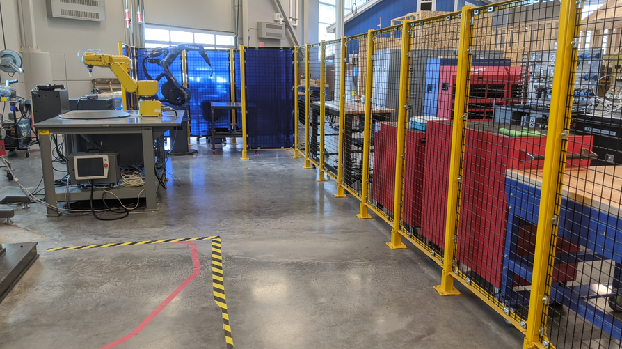

# WORK-CELL SETUP AND LAB EQUIPMENT

REVIEW FEDERAL REGULATIONS

https://www.osha.gov/otm/section-4-safety-hazards/chapter-4#intro

## WORK CELLS
- Verify safety barriers around the robot stations
- Orient the bench mounted robots for easier access to power supplies
- Discuss best arrangement of available equipment for use in final projects
- Use proper PPE and all safety equipment as designed

## LOCATE
- First Aid kit
- Eye-wash station
- AED
- Fire Extinguisher(s)
- LOTO kit
- Emergency Stops
- Emergency Exit(s)
- Muster location after leaving KNY
- Tornado shelter(s)
