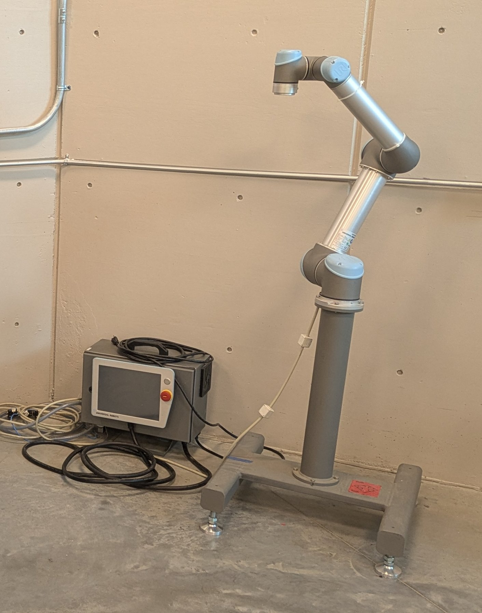

# POWER UP TEST

## TASK

- Record the Make/model of each Robot
- Record the Make/model of each Controller
    - Record the robot “F-Number” for Fanuc models
- Identify the nickname for each robot

## Example
- Robot: UR5 (CB3UR5)
- Controller: 2015350679
- Number: UR5
- Nickname: “Silver”

