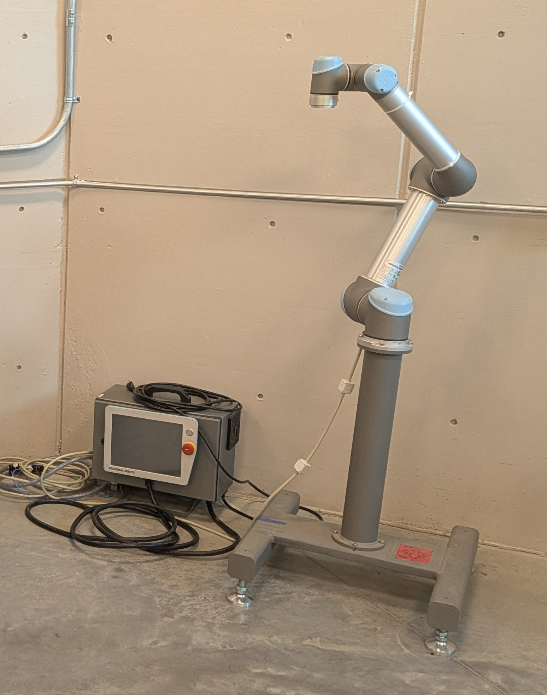

# ROBOT ID & POWER UP TEST

## IDENTIFICATION

- Define what a robot is
- Identify 7 types of robots

### REVIEW FEDERAL REGULATIONS

https://www.osha.gov/otm/section-4-safety-hazards/chapter-4#intro

## LAB TASK

- Identify the nickname for our Robots
- Record the Make/model of each Robot
- Record the Make/model of each Controller
    - Record the robot “F-Number” for Fanuc models

### Example
- Robot: UR5 (CB3UR5)
- Controller: 2015350679
- Number: UR5
- Nickname: “Silver”

## POWER UP

- Plug in power supplies, as applicable
- Power on all Controllers
- Observe and record error messages present on the TP
- Clear all alarms
