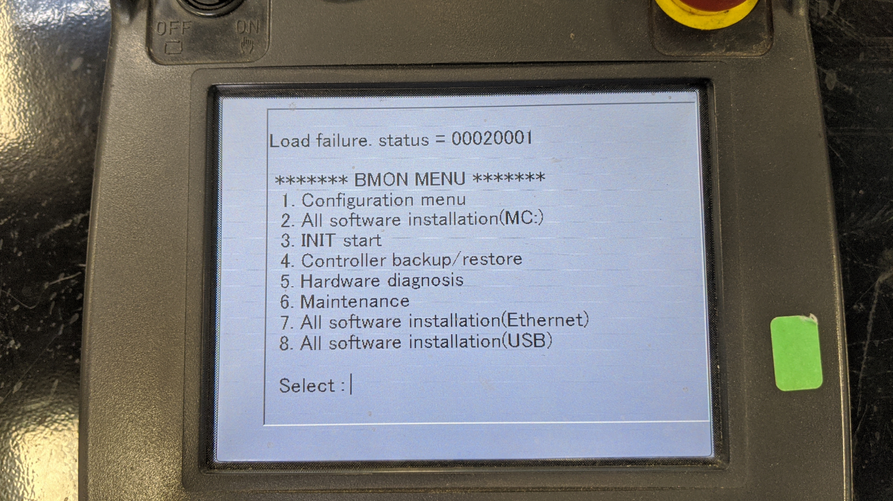

# CREATE CONTROLLER BACKUP IMAGES

## TASK
- Perform a backup of the controller image via the Controller (UD1)
- Perform a backup of the controller image via the TP (UT1/TP1)
- Perform a backup of the programs from the "Files" menu on the TP

