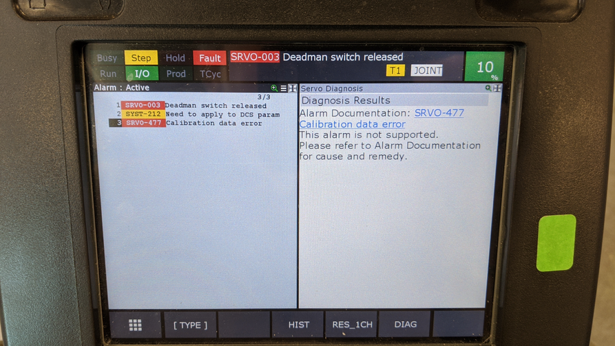
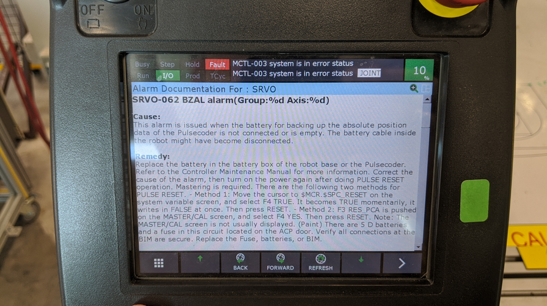

# TROUBLESHOOTING ALARMS

## REVIEW LED CODES FOR MAINBOARD

Evaluate, diagnose and correct common alarms during start-up.

## IN CASE OF DEAD BATTERIES...

See **Homebrew** notes for the specific procedure.
