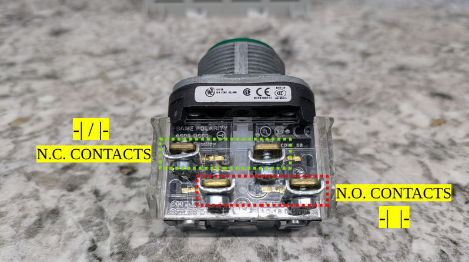

# BASIC PUSHBUTTON WIRING

For this example, power moves from left to right

- The internal contacts are arranged in pairs horizontally (parallel)

Wire (arrow) comes in from the left and goes out the right...

You can wire in/out on the NC and NO at the same time!

You CANNOT wire in on one pair and out on another pair (diagonally)

