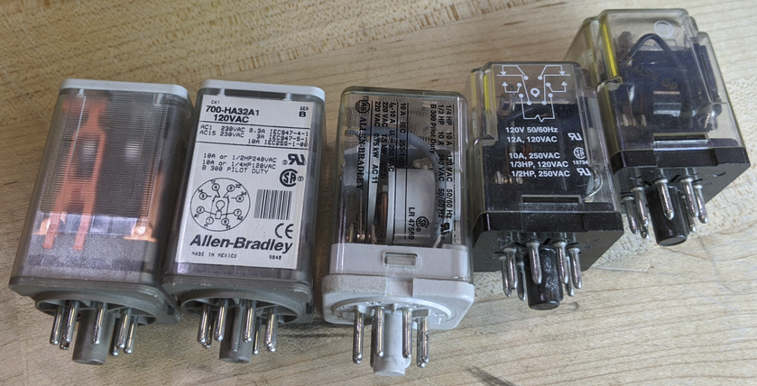

# RELAY AND SELECTOR SWITCH

Complete the following tasks:
- Properly wire (1)) SELECTOR SWITCH (SSW)
- Properly wire (1) ICE CUBE & BASE 
- Properly wire (1) LIGHT to the N.C. contact 
- Properly wire (1) LIGHT to the N.O. contact 
  
*Troubleshoot as needed

NOTE:
- X1-F1 is made via the FUSE
- See Sketch #16 for details.

CONSIDERATION:
- _What is the danger of using a SSW that locks into position vs. a "seal-in" circuit?_

## Relays



## SIMPLE LADDER DIAGRAM

```text
F1     TB+	           SSW	              RELAY 1 Coil		     TB-	      X2
|-----[|||]-----------[    ]----------------( COIL )------------[|||]-----------|
	    |								                          |
	    |	        RELAY 1 N.C.	             Red Light		  |
	    |--------------[ / ]-----------------------( R )----------|
	    |							                           	  |
	    |	        RELAY 1 N.O.	            Green Light		  |
	    |--------------[   ]-----------------------( G )----------|
```
