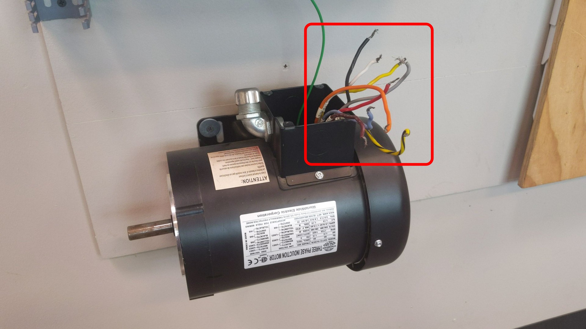

# ELECTRIC MOTORS AND CONTROL SYSTEMS

## REMINDER

- **DO NOT** insert or remove fuses with your fingers!
    - Always use fuse pullers

- No wire nuts are permitted to be used as wire junctions
    - Find a proper length of wire to make your connections
    - The only place wire nuts will be used is on the 9-wire motor connections (see below)

