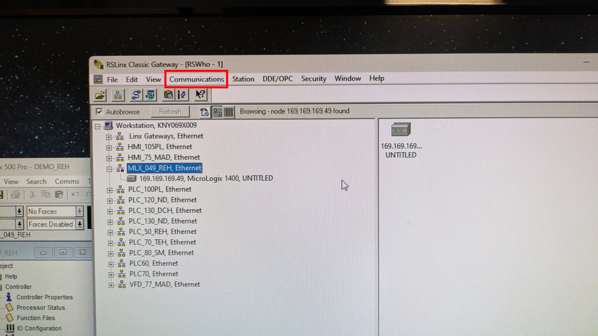
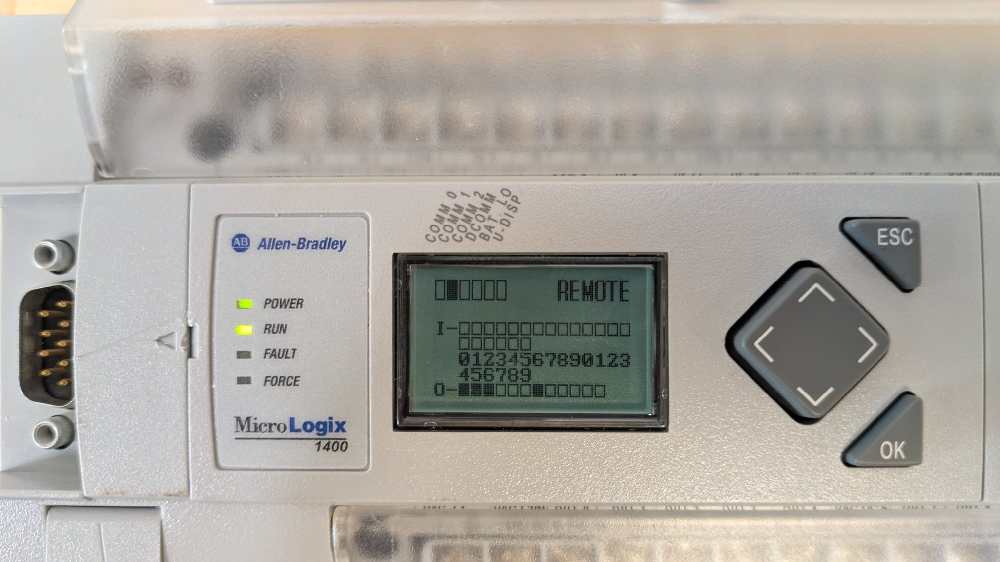
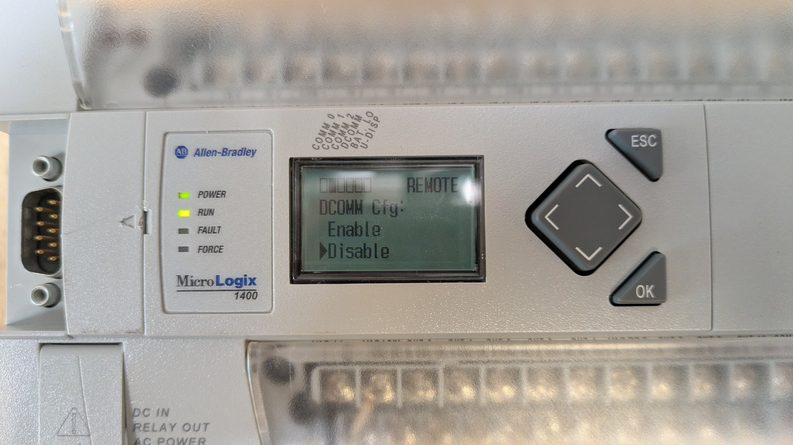
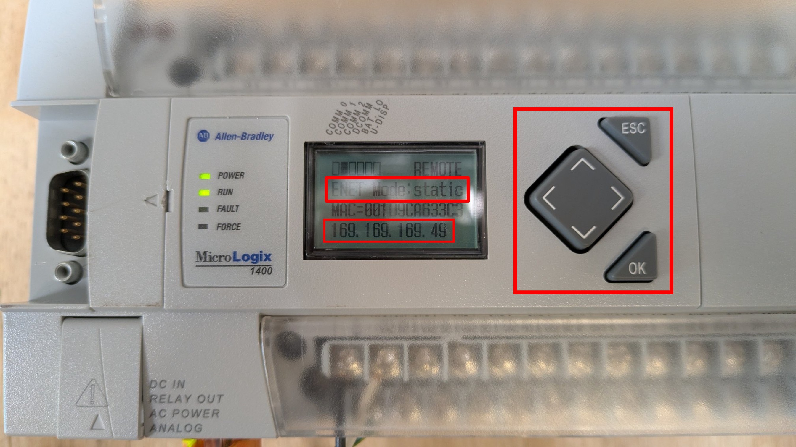
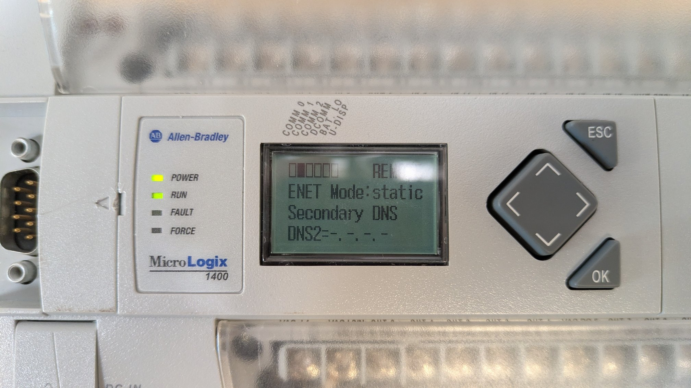
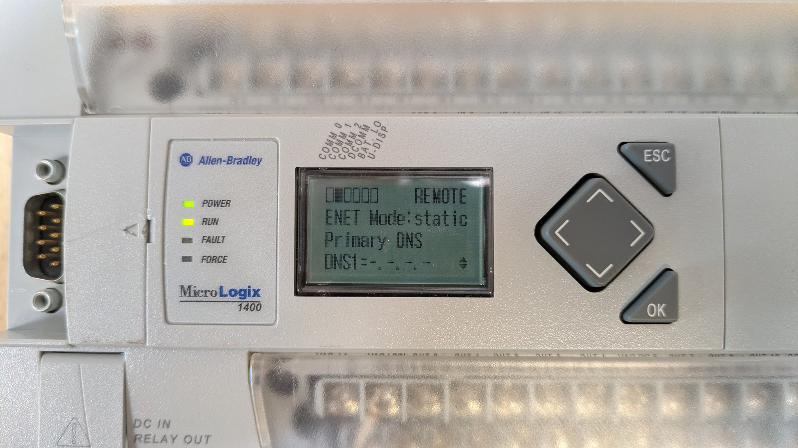
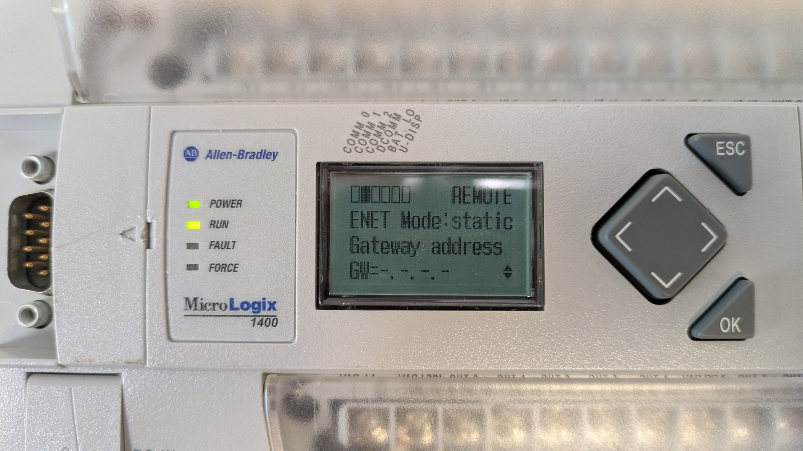
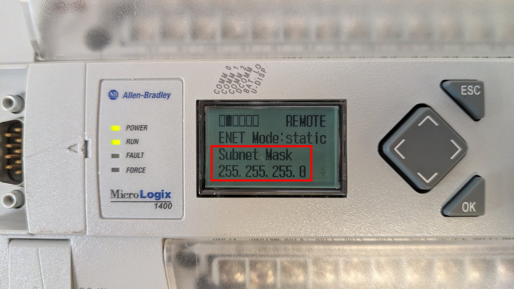

# MICROLOGIX IP CONFIG

## RSLinx DRIVER
- Ethernet/IP > manually enter the IP you need

## REMOTE Mode

## DCOMM Disabled

## ADVANCED SETTINGS
- Set the Ethernet Mode to STATIC
- Manually enter the IP address

## LEAVE BLANK

## LEAVE BLANK

## LEAVE BLANK

## ADD THE SUBNET MASK ADDRESS
