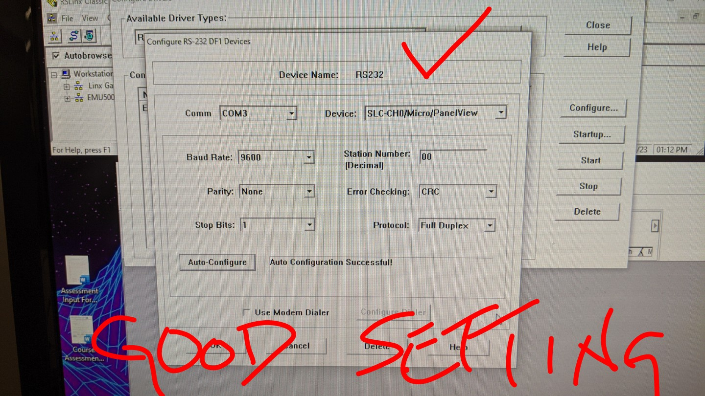
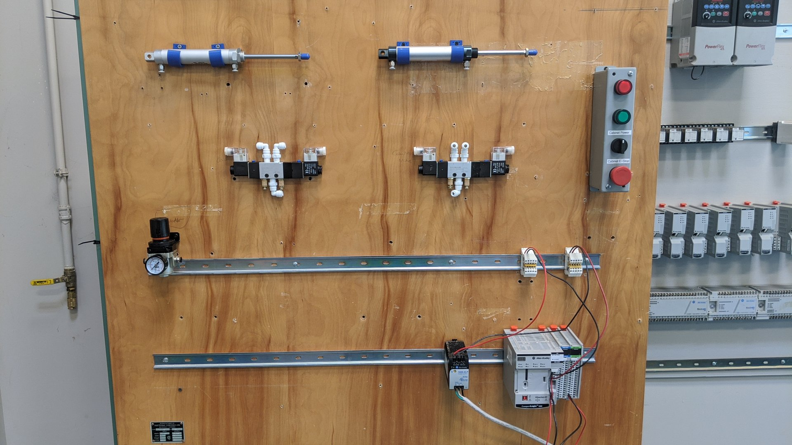

# FLUID POWER PNEUMATIC TRAINER

- Use RS500 programming language
- Use MicroLogix PLC equipment

- Use the following FP equipment in lab:
    - Directional Control Valves
    - Pneumatic Actuators
    - Pressure Regulators
    - Proper hose connections

## SAFETY FIRST

- Eye protection will be provided (mandatory)
- System pressure will not be applied without direct Instructor supervision

## PREVENTATIVE MAINTENANCE

- Air lines will be drained of any moisture PRIOR to the start of lab operations
