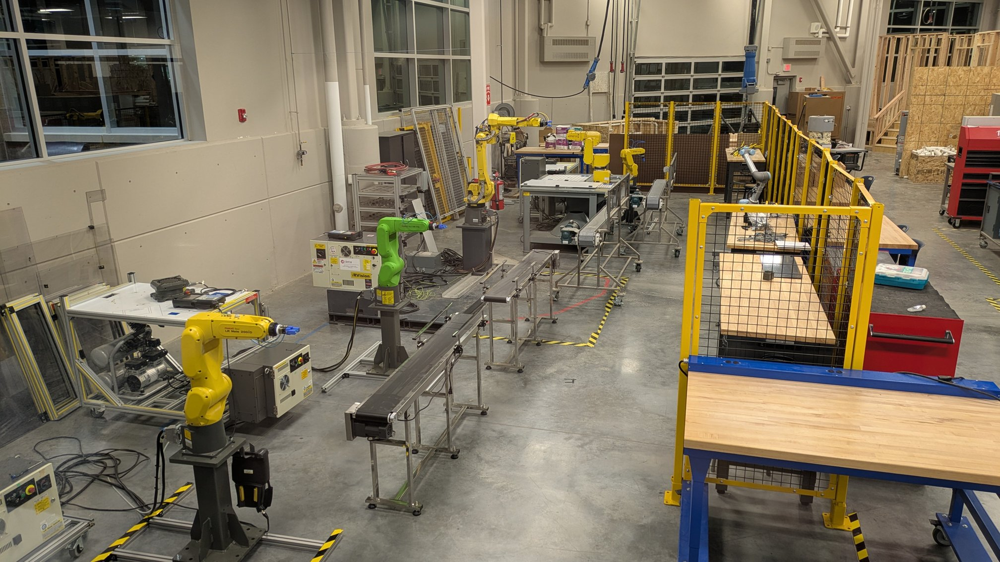

# IIOT LAB CONVEYOR MODIFICATION

## PRIMARY OBJECTIVE

- Install DIN rails
- Install terminal blocks for the DIN rails
- Mount  motor starter, contacts, and ice-cube relays
    - _Leave enough room for a PLC_
- Install 120VAC single-phase wiring
    - _Use floor runners to safely cover the power and data cables_
- Manually test the operation of the motor starter
    - _If reverse capable, test the operation_
- Adjust the belt tension as needed
- Move and align conveyors as needed

## SECONDARY OBJECTIVE

- Manufacture sensor brackets (if capable)
- Install sensor brackets (if available)

