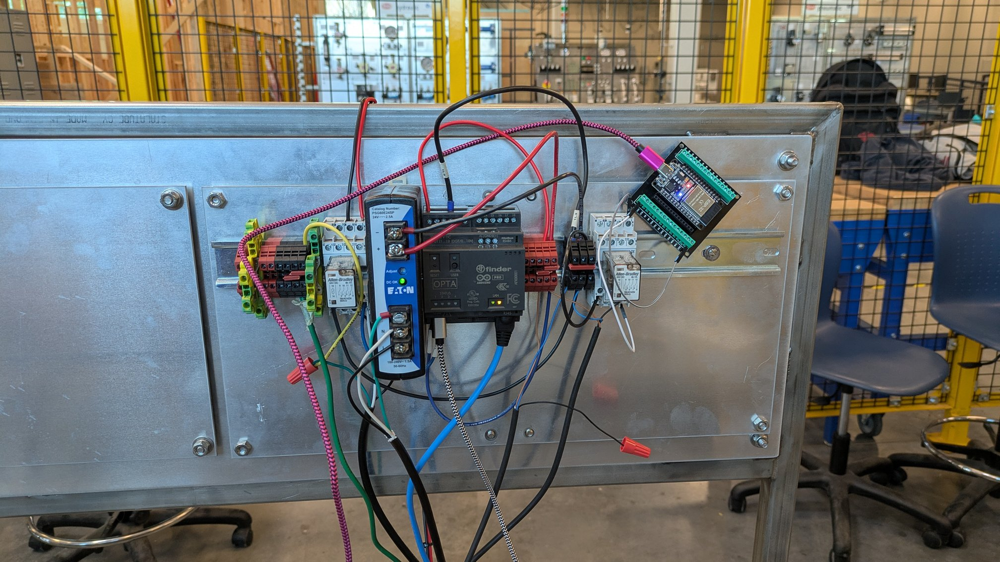
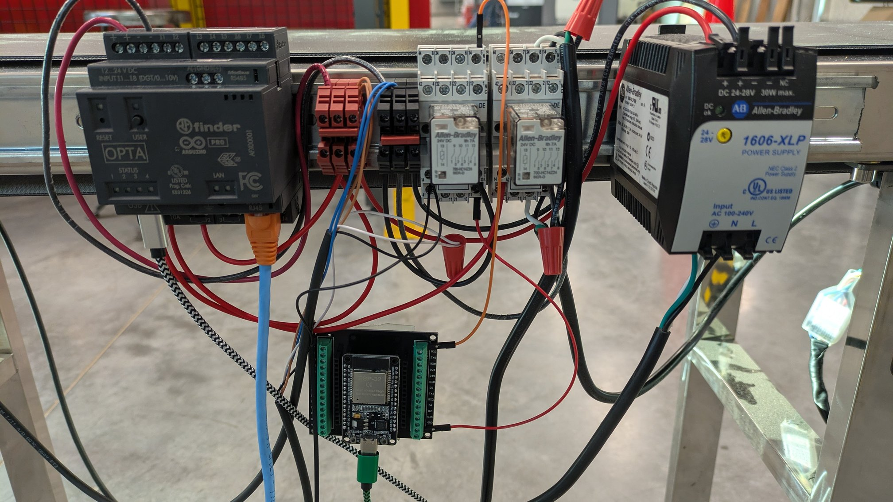

# OPTA + CONVEYORS

- Install and wire OPTA PLCs for power
- Make all necessary network connections (eth0)
    - _see the Static IP notes in Homebrew_

## Sketch 1

- Code to operate the conveyor motor relay using the OPTA User Pushbutton
    - Simple toggle on/toggle off

## Sketch 2

- Code to operate the conveyor motor relay using a Node-Red interface
- Include the following:
    - IP address/domain
    - MQTT monitoring
- Modify the User Pushbutton to act as an emergency stop only (no toggle)

## WIRING EXAMPLES

### Example 1

### Example 2

