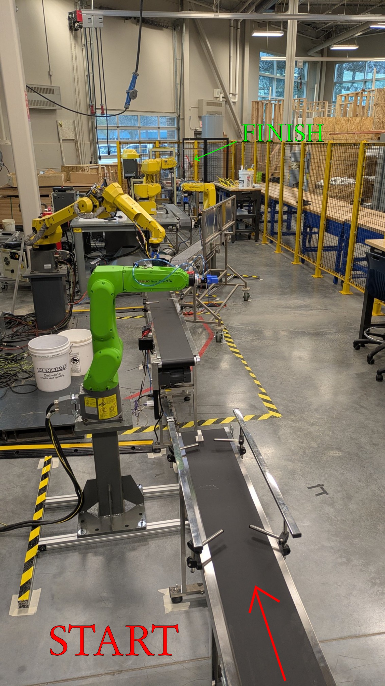
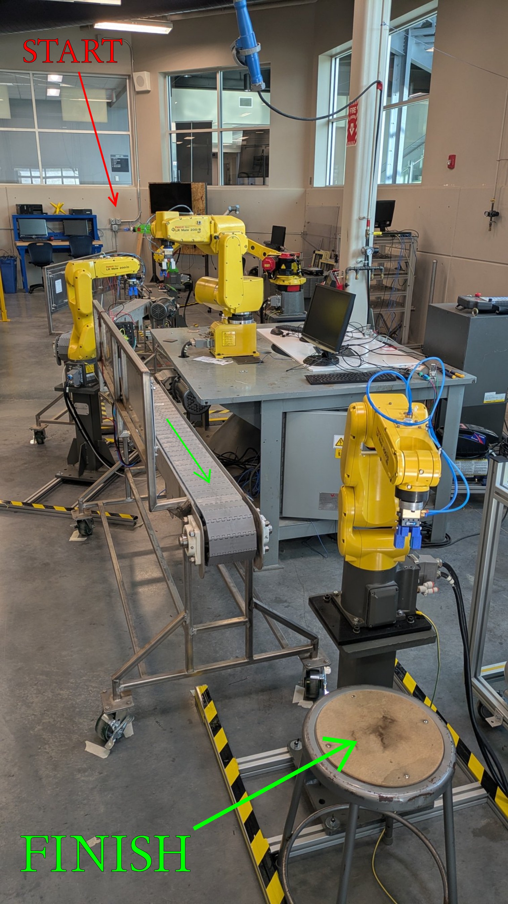

# FINAL LAB PROJECT

- Move a package from Point A to Point B
- Move the package 3 times without error
- Use all work-cells to accomplish
- Display operational statistics on the main monitor:
    - Runtime for each work-cell
    - Overall runtime for entire process
- This data will help determine areas for improvement
    - _Remember: Time is money!_

### STARTING POINT

### END POINT

