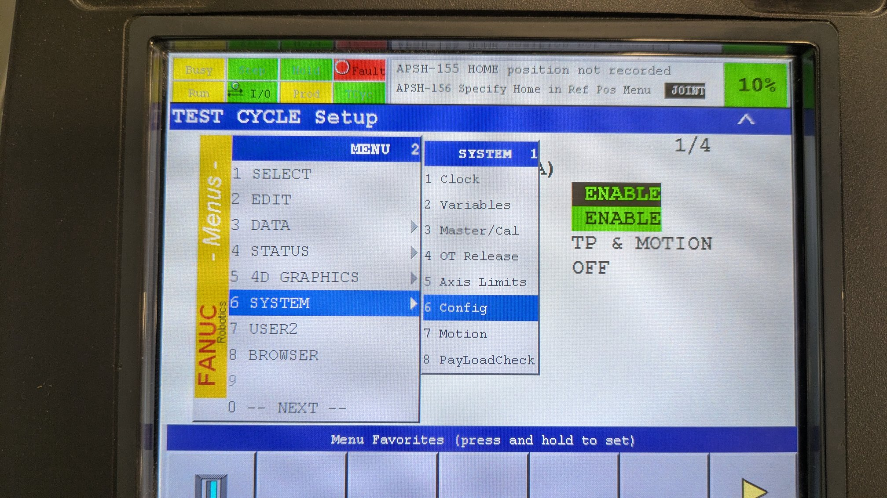
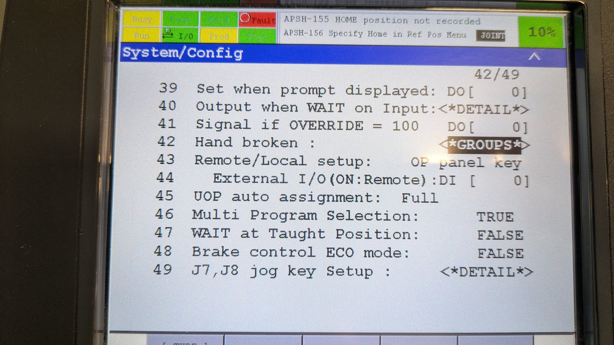
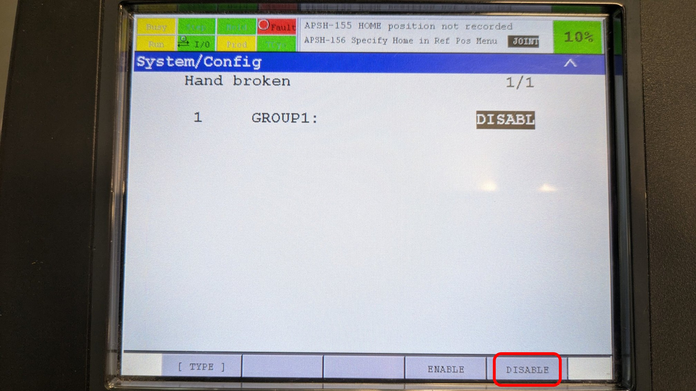
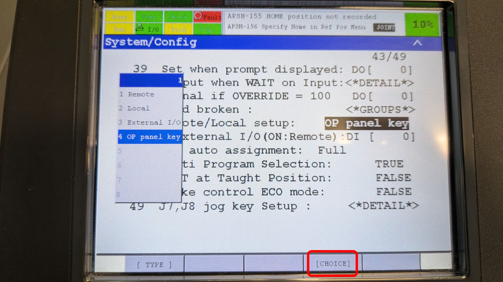

# FANUC AUTOMATIC CYCLE MODE

## These steps should help you prepare the robot for running in automatic

- Navigate to **Menu > System > Config**

- Scroll to **"Hand Broken"** and **disable**

- This will deactivate the deadman switch

- Set **"Remote/Local"** to **"Op Panel Key"** by using the **[CHOICE]** menu option

- Some models may work differently.
- If OP PANEL KEY doesn't work, try "LOCAL"

## WARNING

### Exercise extreme caution when running in automatic, as serious injury may result!
