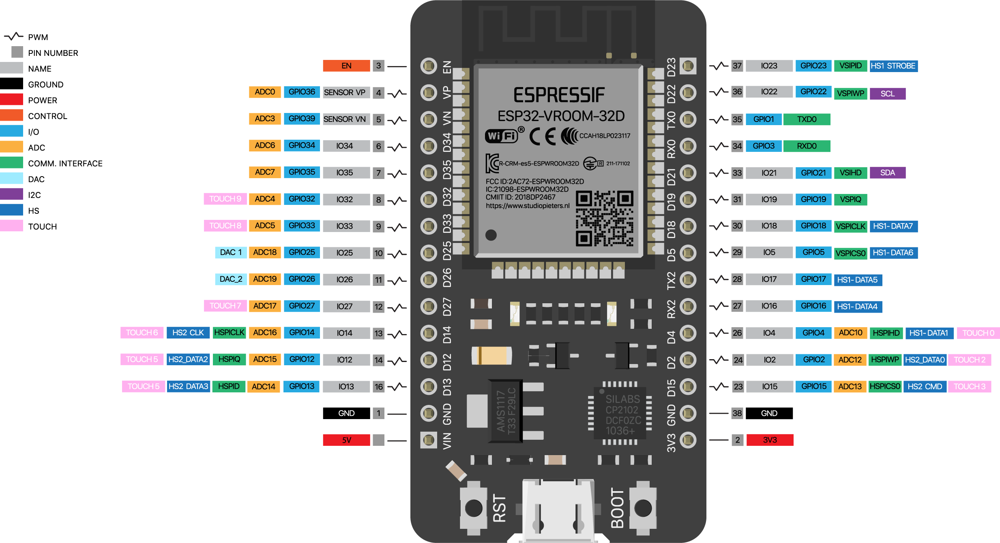

# ESP32 DEV BOARD

ESP32 PINOUT: https://lastminuteengineers.com/esp32-pinout-reference/

## Additional ARDUINO Libraries
- PubSubClient by N. O’Leary
- Wifi by Arduino
- ArduinoJSON by B. Blanchon
- MQTT by J. Gaehwiler
- Adafruit MQTT Library by Arduino

## Additional ARDUINO Board Manager Addons
- esp32 by Espressif Systems (takes a very long time to download?)

## Online Simulator
- WOKWI ESP32 Simulator: https://wokwi.com