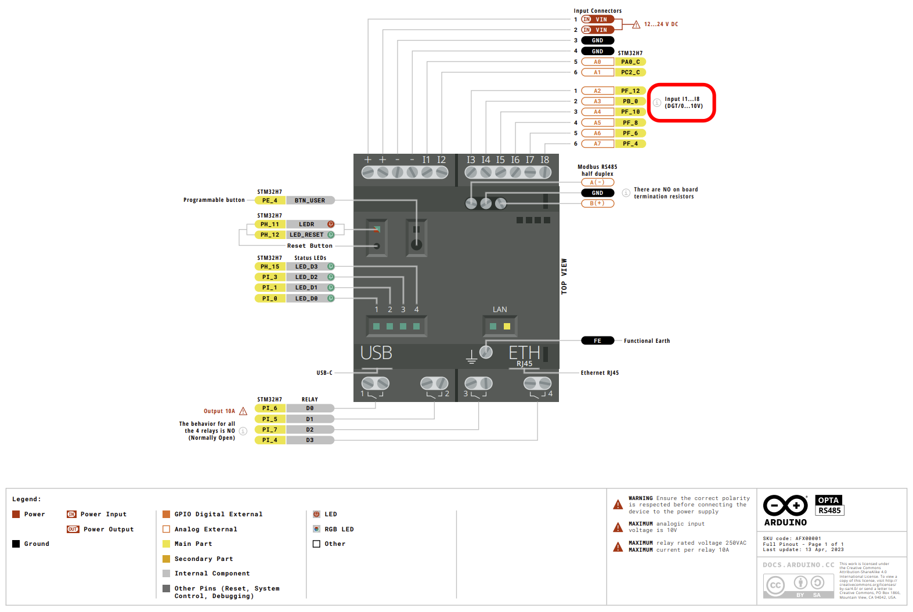

# OPTA CONFIG

- The Inputs of the OPTA only accept 0-10 VDC
- Applying 24 VDC may damage the unit
    - We'll use an ESP32 + MQTT messaging wired to the Sensors to overcome this limitation

[Link to official Arduino OPTA documentation](https://docs.arduino.cc/hardware/opta/)

## Download Additional ARDUINO Libraries
- AlPlc_Opta by Arduino
- Arduino_OPC_UA by Arduino (_do we really need it?_)
- Adafruit MQTT Library by Arduino

## Additional Additional THIRD-PARTY Libraries
- PubSubClient by N. O’Leary
- ArduinoJSON by B. Blanchon
- MQTT by J. Gaehwiler

## Download additional BOARD MANAGER Addons
- Arduino Mbed OS Opta Boards by Arduino (takes a long time to download?)