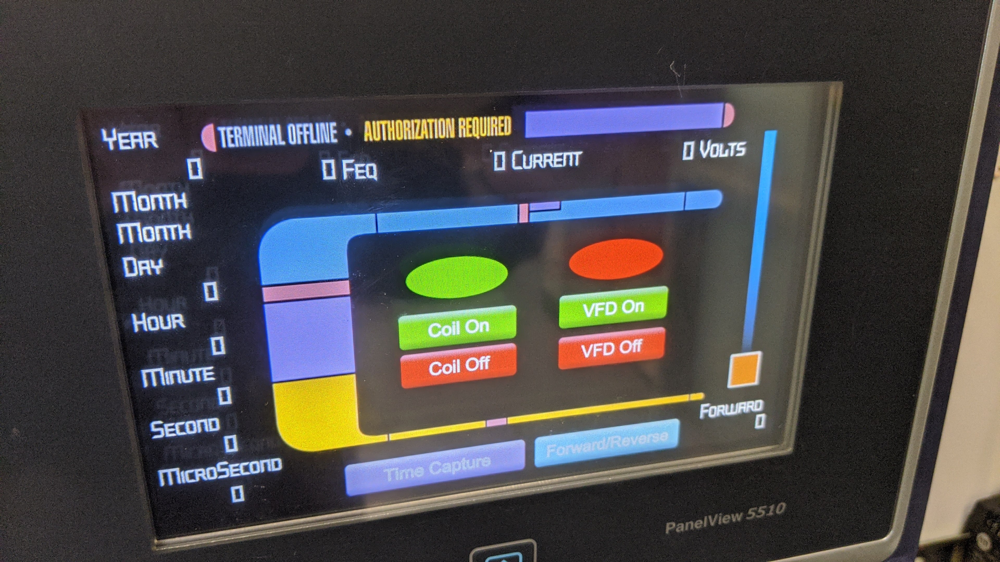

# Motor Wiring with Local HMI Control

### Create an LCARS interface for local control using the following components:

- 3-phase AC induction motor
- Contactors & Relays
- Power Supplies

## PARAMETERS:

- HMI buttons act as momentary push-buttons
- "Send a 1 on press, send a 0 on release"
- Use a proper "seal-in" circuit
- Include Stop and Start buttons on screen
- Include Stopped and Running indications on screen
- Capture the starting GSV data for display

## EXAMPLE
