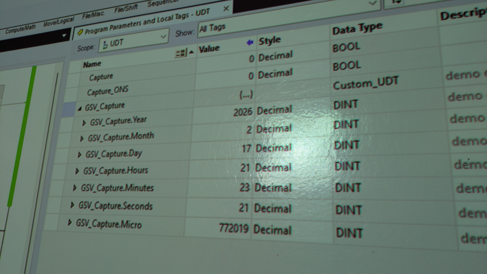

# UDT - User-Defined Type for custom GSV capture

## CODE:

Create a simple HMI routine using the following instructions:

- Custom User-defined Type (UDT) 
- GSV - GetSystemValue
- All necessary XIC, XIO and/or ONS 
- Does not require a DINT[7] array
    - but it does require a UDT with 7 elements

## LOAD:

- Properly configured HMI screen
- Properly configured I/O modules for any visual feedback
- All networking pathways properly configured

## PARAMETERS:

Collect and display WallClockTime - DateTime data on an HMI screen as follows:

- Custom_UDT_Tag_Name.Year
- Custom_UDT_Tag_Name.Month
- Custom_UDT_Tag_Name.Day
- Custom_UDT_Tag_Name.Hours
- Custom_UDT_Tag_Name.Minutes
- Custom_UDT_Tag_Name.Seconds
- Custom_UDT_Tag_Name.Microseconds

### Must include onscreen navigation for capturing and clearing recorded values.

*Proper rung documentation is mandatory.

