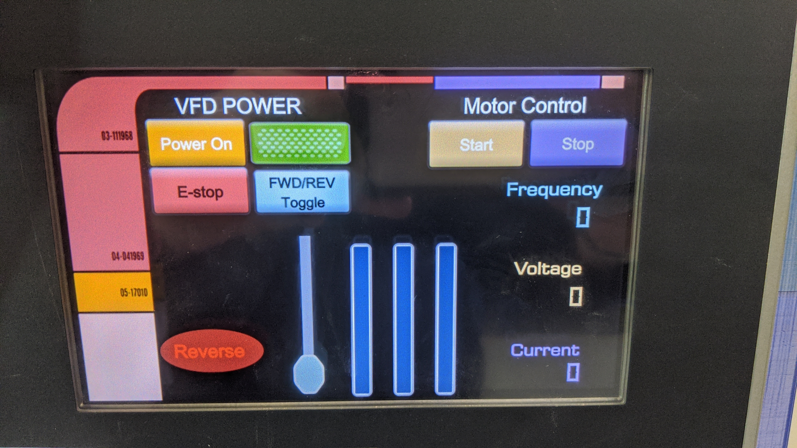

# VFD Local HMI Control

## Create an LCARS-style HMI interface for local VFD control using the following components:
- 3-phase AC induction motor
- A-B Variable Frequency Drive (PowerFlex 525)
- Contactors & Relays
- Power Supplies & Fuses
 
## INCLUDE THE FOLLOWING LOCAL SCREEN ELEMENTS:
- Start/Stop control for the contactor
- Start/Stop control for the VFD
- FWD/REV for the VFD
- Numerical/Graphical displays for voltage/frequency/amperage
- Slider control(s) to change the frequency of the VFD
- UDT GSV Date/Time start capture

## EXAMPLE

## REFERENCES:
- PowerFlex-525-QuickStart.pdf
- Wiring Sketches in the Homebrew Folder
- VFD Parameters in the Homebrew Folder

## GRADING:
- I will grade everyone based on the operation AND aesthetics of their project.
- This means you need to work very hard to create something visually stunning.
    - _I want Gene Roddenberry to weep at its magnificence!_
 
*Proper documentation and rung comments are mandatory.
 
### Remember: if the project doesn't work, you don't get paid.