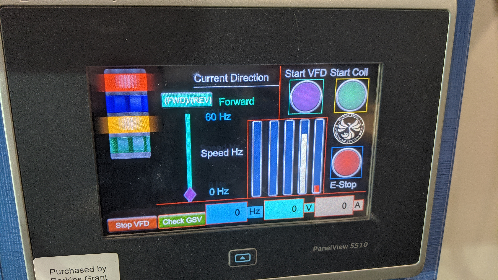

# VFD REMOTE HMI CONTROL

Create an LCARS-style HMI interface for remote VFD control

## REMOTE CONTROL ELEMENTS:
- Work in groups of 2
- Start/Stop VFD
- Frequency Control
- Displays for Volts, Amps, and Freq.
    - _This may require some clever programming_

## EXAMPLE
