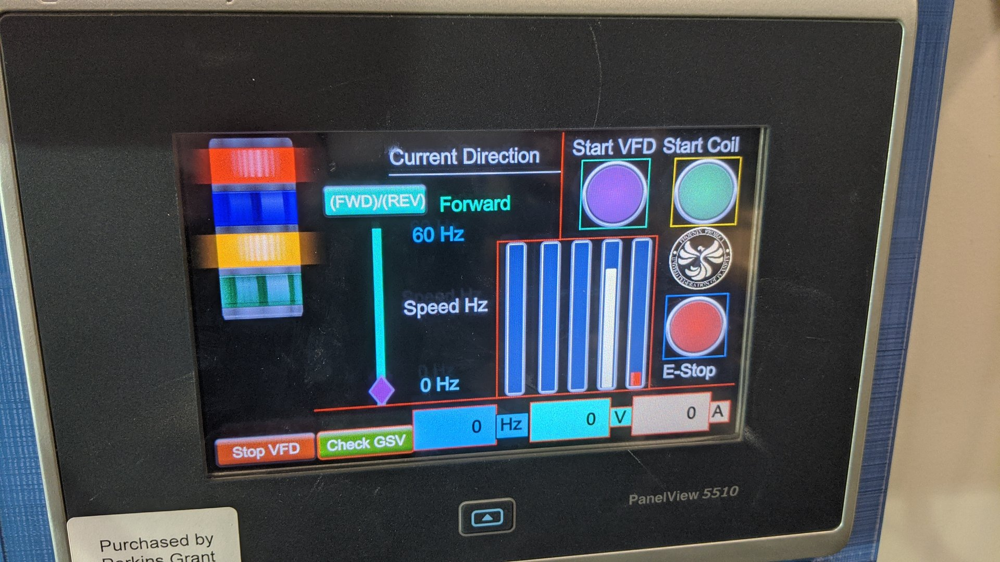

# VFD REMOTE HMI CONTROL

Create an LCARS-style HMI interface for remote VFD control

## REMOTE CONTROL ELEMENTS:
- Start/Stop the remote VFD
    - _This means placing the remote VFD in RUN mode, not enabling the contactor coil that powers the VFD_
- Frequency Control by use of a Slider
- Displays for remote VFD Volts, Amps, and Freq.
    - Must show the values somewhere on YOUR screen
    - _If you use a Popup, make sure it is large enough to fit all the required data_
    

## LOCAL > REMOTE > LOCAL AGAIN
- Code your project in such a way that retains the ability to run your local VFD after running the remote VFD
- _You must not lose local control of your VFD after successfully running the remote VFD_
    - _This may require some clever programming_

## EXAMPLE

### Note: Additional elements from the LOCAL HMI CONTROL project may apply to this remote program!

## REFERENCE

PowerFlex 525 Quick Start PDF:
[PF525-Quick-Start](https://literature.rockwellautomation.com/idc/groups/literature/documents/qs/520-qs001_-en-e.pdf)
