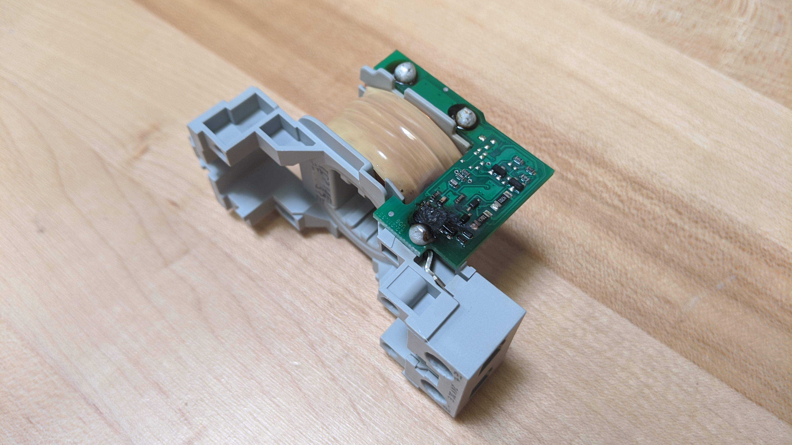
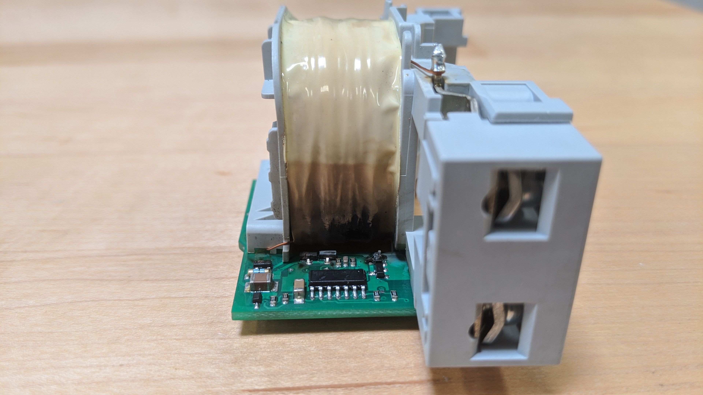
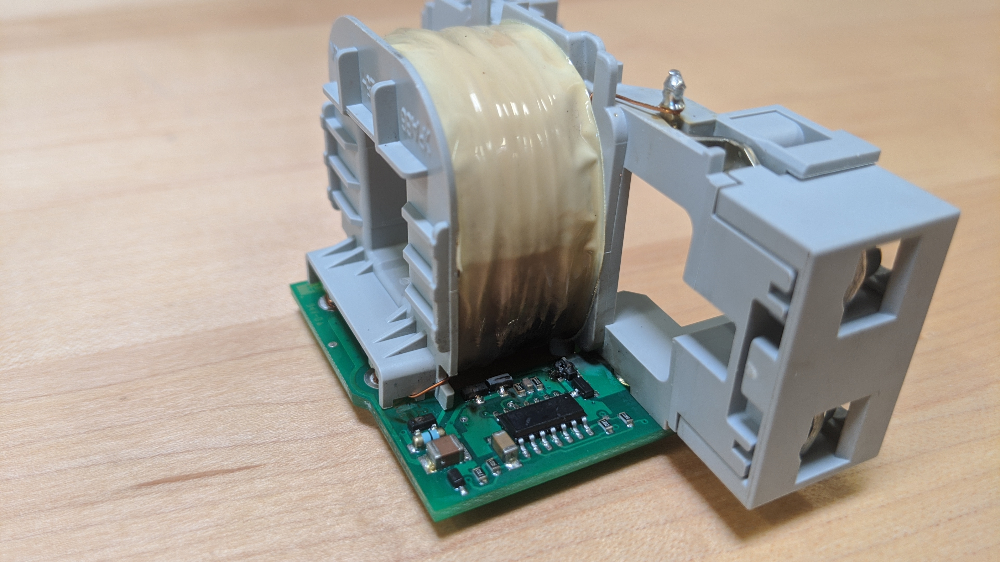

# WARNING ABOUT WIRING COILS

- Make sure you read the voltage specs for each coil.
- Putting 120 VAC to a coil rated for 24 VDC results in the following:

- Someone let the magic smoke escape!

- The coil covering is NOT supposed to be that shade of burnt!

