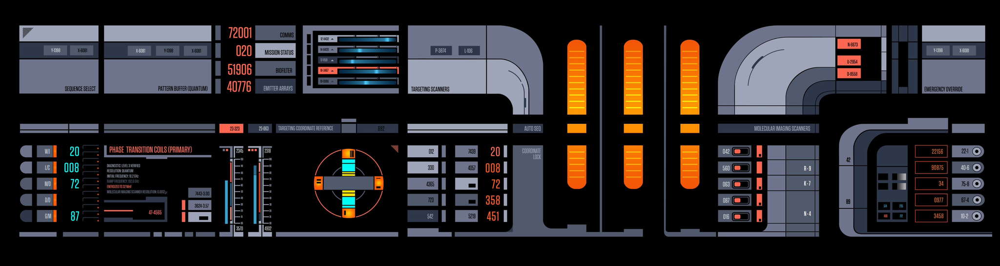

# Library Computer Access and Retrieval System (LCARS)

- [LCARS wikipedia page](https://en.wikipedia.org/wiki/LCARS)
    - Use Google Images to search for "LCARS templates" or "LCARS blanks"
    - Using a .PNG file will allow you to remove backgrounds and create transparencies
- [Transporter Slider Control](https://youtube.com/shorts/XKDkUvfNfbU?si=5L1KC5TYYIPuhakl)
- [Someone built a Transporter in their house](https://youtu.be/m2lyqBjLFvs?si=VTvJniMu5NVsZ3lz)
- [Star Trek Interfaces (LCARS)](https://youtu.be/naI31s-K0jk?si=9sC2ln9T_-FES6to)
- [10-hour LCARS screensaver](https://youtu.be/hsP-kWvl1ds?si=nlScfcXJ6WvRKTN2)

## Example
