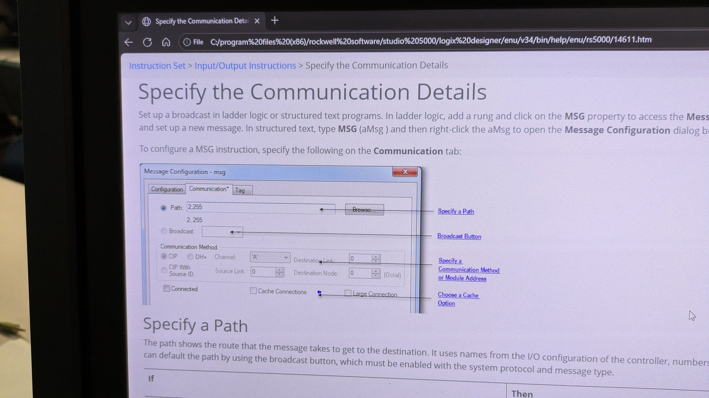
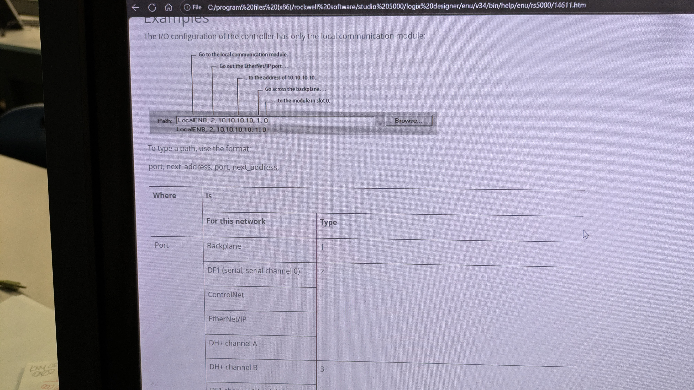

# MSG Message instruction

- In Studio 5000 > F1 Help > search for “Specify the Communication Details”

- This will give the formatting of the Message pathway

## CIP DATA TABLE WRITE
- MSG pathway format for emulation: add the 2nd emu controller to your I/O back-plane and select as Path
- MSG pathway format for lab: "2, IP address of target PLC, 1, 0"

## PARAMETERS
- Controller Scope Tags
