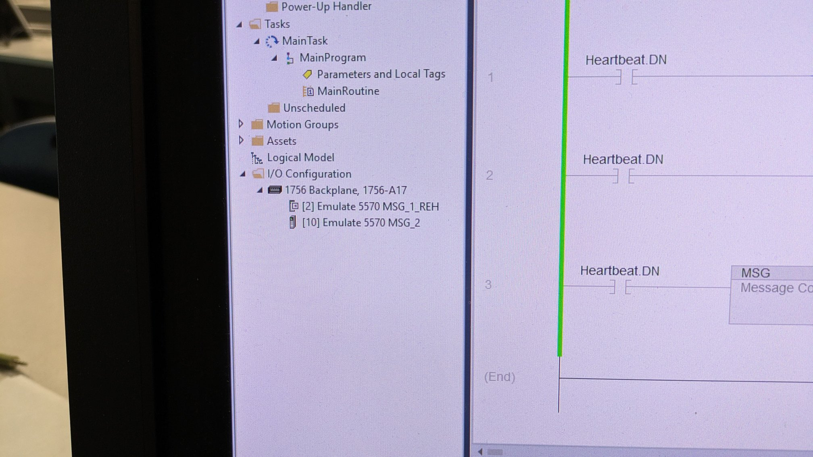

# PRODUCED AND CONSUMED TAGS
- Prod/Con constantly sends data.
    - _Is this better or worse than MSG?_

## NOTE
- Use Controller tags instead of Local tags

## REMINDER
- Your controller must have the target device added to the I/O configuration tree for this to work

- See “Connection Requirements of a Produced and Consumed Tag” in the F1 Help sections

