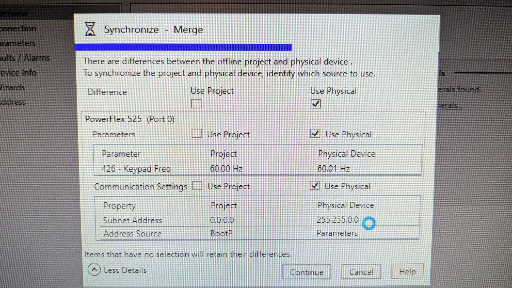
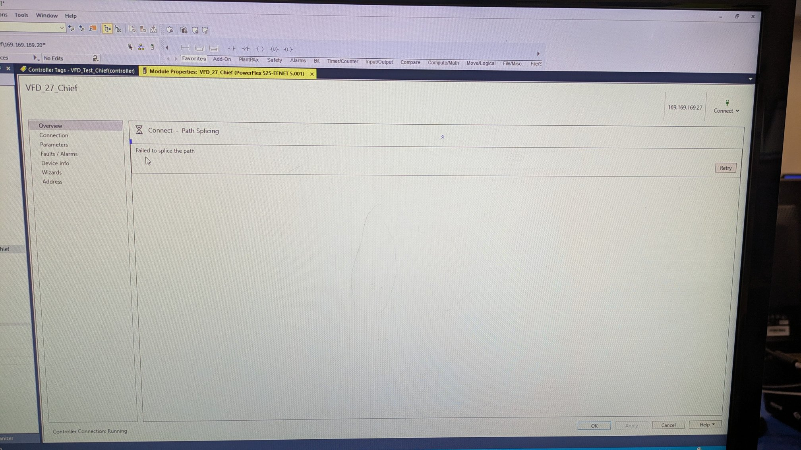
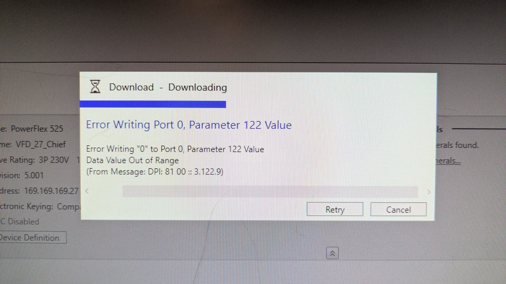

# BACKGROUND

## THIS IS A WORK IN PROGRESS. MORE TESTING IS REQUIRED!
-  using these lab PCs failed:
	- 2, 8, 10, and 11  ❌
- VFD driver in RSLinks
- set VFD Parameters to Ethernet/IP
	- 46, 47, and 51 ✅
- does not require code
	- run a single -[NOP]- if needed
	- trigger coil from Tags

# PLC OFFLINE STEPS
- add IO modules to tree
- added VFD to I/O tree
- ran Device Definitions 
    - set proper IP and FRN

# PLC ONLINE STEPS
- clicked "connect" in upper right
	- selected Synchronize
	- add driver to ip address
- download to PLC like normal
- place online
- toggle output module tag to turn VFD on
- wait for VFD to be recognized
- double click VFD in COW
	- check marks in Physical
	- wait for full green horizontal line
- test start/stop from module tags

***

# MY SOLO TEST
- Drivers added
- Output module
- Put PLC online
- Set bool to 1 for VFD coil
- Took offline
- Did VFD wizard
- Clicked create
- Skipped "Connect"
- Re-download project
- Set coil bool to 1
- double-click VFD properties in COW
- Got "splicing error" alarm

- options in "Connect" are greyed out
- Took offline
- Did "connect - synchronize"
- Added driver to VFD
- Got the Merge dialog
- Selected Physical because of SUBNET values

- Click finish
- Closed out vfd dialog
- Downloaded again
- Set coil bool to 1 again
- Failed to splice again
- Tried "Connect - Download" and got an error

- "Connect - Synchronized" while offline 1 more time
- placed back on and double-clocked VFD in COW
- Still a splice failure!

## BUT...

- After all that mess, I manually adjusted the VFD.Start BOOL and CommandFreq DINT from the global tags just to see what would happen...
	- And it worked!!!
- So, we kept going and never looked back.