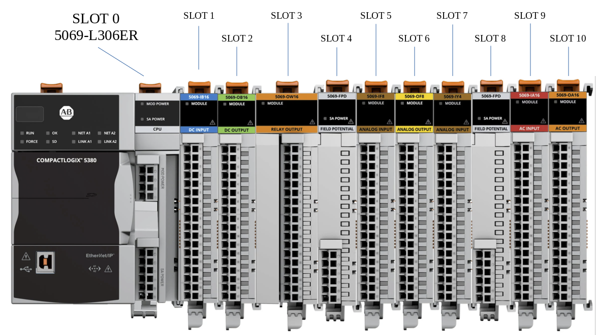

# CONVERT AN EMULATED PLC PROGRAM TO A LIVE-ACTION PROGRAM FOR LAB

Note: Keep a safe backup of the original emulated program for future testing.

This procedure assumes the following:
- RSLinks Classic is already up and running in the background.
- You have properly configured a Communications Driver that targets the correct PLC address (example: computer 169.169.169.5 will target PLC 169.169.169.50 and HMI 169.169.169.55).

Note: You can target all PLCs from all computers, as long as the Communication Driver is properly setup on each computer that you are using.  Additionally, you can target all PLCs from a single computer, as long as that computer has a Driver configured for EACH PLC/HMI you target.

## Change Controllers:
- Open Studio 5000 and open your emulated project .ACD file.
- Find your emulated controller in the lower left-hand side of the Control Organizer Window (COW)
- Right-click the controller > select Properties > and change the following:
    - Controller Type > select “5069-L306ER – CompactLogix 5380” from the drop-down
- Accepts all the warning by hitting OK.
- VERIFY that the slot number changed to 0

## Change IP MODE:
Once that is finished, click on ETH/IP Mode button near the bottom of the same page.
- Change the Mode from Dual to Linear (just like we did during the flashing procedure)
- Accept all the warnings.  Wait for the process to complete.
- Click OK/Save to finish and close the window.

## Add Digital (24VDC Discrete) Input and Output Modules:
- Right-click “Backplane” and add New Modules (search 5069-IB16 and 5069-OB16)
- Enter the SLOT location for each module position located on the chassis (see below)

## Establish a Pathway to the live PLC in Studio 5000:
- Click the RSWHoIs icon to bring up the active network within Studio 5000 (not in RS Links).
- Select the target PLC from the list of active components.
- Highlight the target and select “Download” on the right.
- Accept/Acknowledge all warnings.
- Wait for the program to send from the PC to the active PLC.
- If asked to put the PLC in RUN mode, click OKAY/YES/ACCEPT.
- The program should now show GREEN bars on the left and right side of your ladder rung code.

### If this did not happen, check the following:
- Check if you are in REMOTE RUN.
- If so, go to COMMUNICATIONS and select RUN MODE.
- Accept any warnings.  This should place the GREEN bars on each side (see above).
- If not, or you get several persistent warnings, check the following:
    - Check the TOGGLE SWITCH on the target PLC is in the REMOTE position (middle).

## PLC and Module Configuration
Note: This is only 1 possible configuration of the I/O modules.Verify the location of YOUR modules in the lab!

