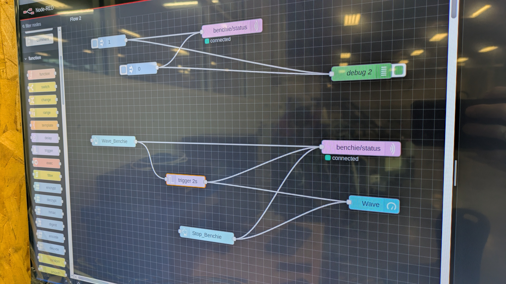

# LAB - RASPBERRY PI OS ORIENTATION

- Establish a static IP address for each RPi
- Ping the central RPi hub

- Ping all other RPi on the network
- Send data to the central RPi hub for dashboard display (Counter function)

- Trigger messages via MQTT using all RPi on the network (in sequence)
