# RED's REPORT

## Ethernet/IP configuration for R-30iA / R-30iA Mate / R-30iB Controllers

> _This report was authored by Mike Williams in collaboration with Mikalah Czaplewski as part of the requirements for the final design project._

This work instruction is for the setup and configuration of the ethernet settings for the controller itself and for setting up D I/O that can be controlled over ethernet by a PLC. This instruction only goes over how-to setup these I/O as an adapter not as a scanner and also only goes over how to establish a connection with Studio 5000 software.  You will need to have a configured network switch, a working PC with Studio 5000 and RSlinx installed, a R-30iA / R-30IA mate / R-30iB controller mad by Fanuc, a configured CompactLogix 5380 (5069-L306ER) made by Allen Bradley and several ethernet cable. 

## 1. Setting up the physical network

The first step that must be done is setting getting the controller attached to a network. With the power off open your controller and look for the two ethernet ports as shown in Figure 1 on the right. They are typically on the main board for the controller and are call CD38A and CD38B. Either one or both of these ports can be configured for ethernet/IP. **Note:** that if you plan to use both ports they both must be properly configured on separate subnets. We will go over this more in the controller setup section.

For our purposes pick CD38A and connect the ethernet cable to this port and connect the other end to your already configured ethernet switch. With the cable plugged in and ran to the switch you can close the controller up.

Next, we will need to get the PLC attached to the network. This Instruction assumes you have properly setup the PLC beforehand with its IP address and have it updated to its latest firmware. Make sure you have the IP address written down you will need it later. For our purposes we are using an Allen Bradley CompactLogix 5380 (5069-L306ER). On the bottom of the PLC you will want to connect another ethernet cable to port A2. This is the port closes to the back of the PLC as shown in Figure 2. The other end of the cable can be hooked up to the network switch. 

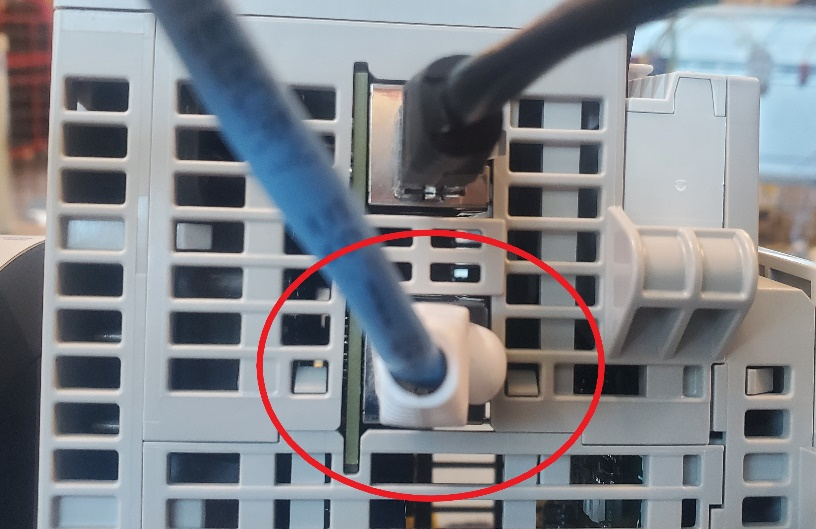
   
Last, we need to get the PC attached to the same network. If you have a PC that is not going to be hooked up to an outside network that would be best if not you will need a PC with a separate ethernet card as shown in Figure 3. Plug a cable into this network card and the other end of the cable to the network switch.

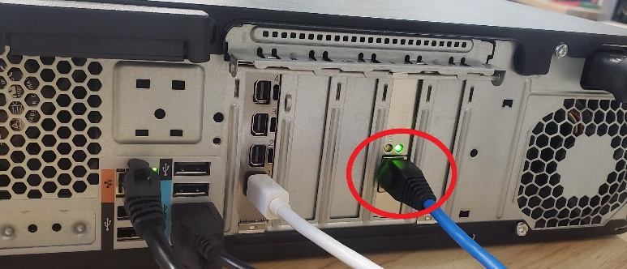

Now we need to set the IP and subnet for this PC. Go to network connections, it is located in control panel>Network and internet. Once there find the adapter you just plugged you cable into and right click it and go to properties. A window called Ethernet properties will appear. Scroll down and fine Internet protocol Version 4 (TCP/IPv4). Lift click this option to highlight it and click the properties button. It will bring up the window you see in Figure 4. Select use following IP address and input your IP and subnet. Remember these numbers we will need them later.

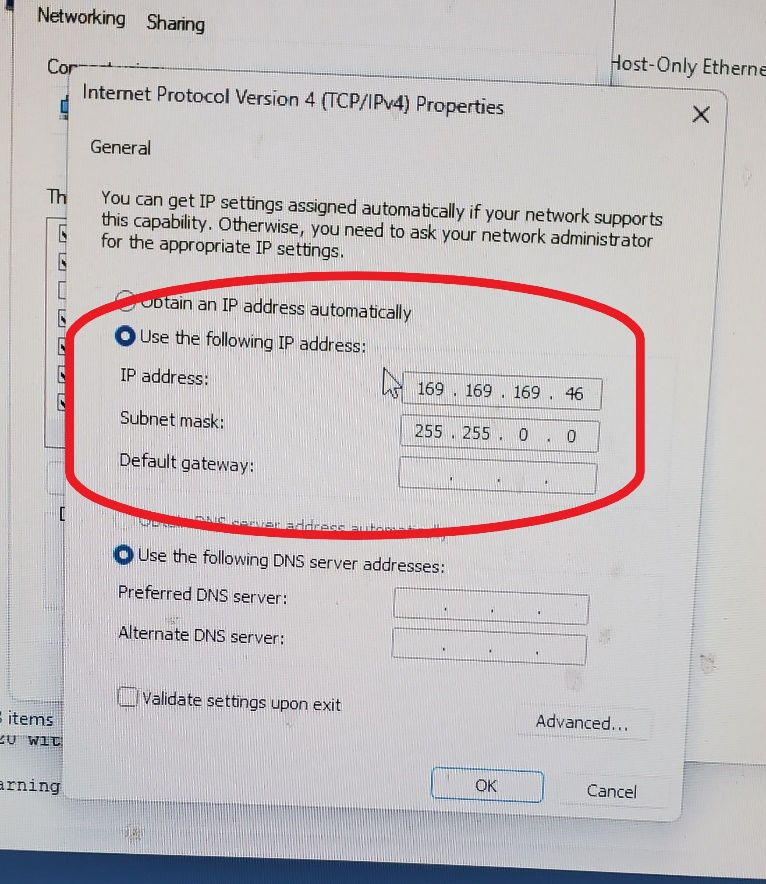

At this point if you have not done so already turn your network switch on. If you see all green lights on as shown in Figure 5 you are set to move on to the next step. If you see orange or no light repeat the steps for the device that does not have a green light above its cable. 

## 2. Controller Ethernet Setup

With all our devices now connected up to the same network we can begin getting the controllers ethernet IP setup. At this point turn you controller on and set the teach pedant to on with the switch in the top right-hand corner of the pendant (you do not need to release the e-stops for this portion). Once the controller is booted up and you see the main screen press the menu button on the controller to bring up the menu as seen in Figure 6. On the menu screen navigate to 6 SETUP and press the right arrow button. Then navigate to 0 –NEXT— hitting again the right arrow button. Then go to 6 Host Comm and press enter.

After you press enter on Host comm it will bring up a page called SETUP Protocols with 10 different options to pick from as shown in Figure 7. The only option we need for our purposes are option 1. TCP/IP. Highlight Option 1 and press enter on the teach pendant.

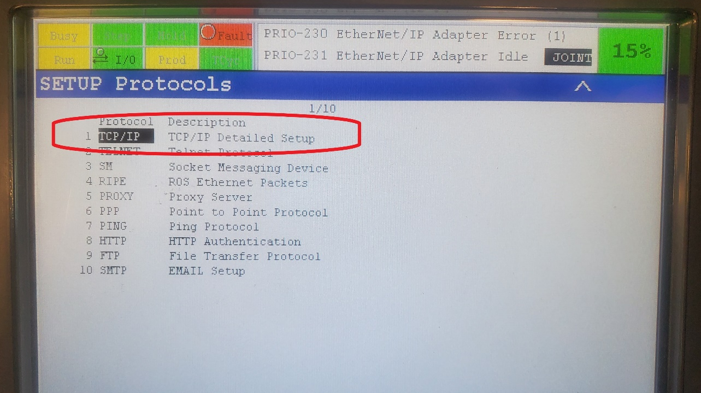

If you selected option 1 you should pull up a screen call SETUP Host Comm as shown in Figure 8. This screen is where we will assign an IP address to the robot along with its subnet mask. You will also input the IP address for the other hardware on the network that you want the robot to communicate with here as well.

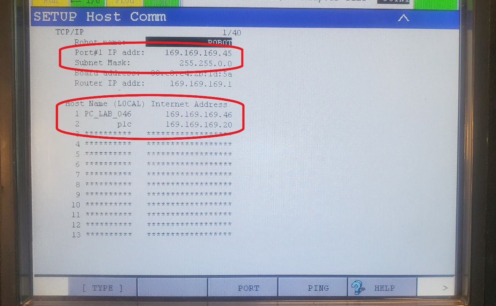

The First thing we must do is make sure we are on looking at the correct port. Notice in Figure 8 the top most circled area you will see Port#1 IP addr:. This signifies what port you are looking at if you are looking at Port 2 it will say Port#2 IP addr:. You need to select the port that you plugged you ethernet cable into on the controller (CD38A is port 1 and CD38B is port 2). If you are on the incorrect port, at in the bottom of Figure 8 next to PING you will see the word PORT. Tapping PORT or pressing F3 on the teach pendant will switch between the two ports. Now let’s give the Robot its IP Address and subnet Mask. Go down to Port#1 IP addr: and hit enter on the teach pendant. The IP address for the robot must match the first 3 set of numbers as your PLC and the PC.

For example, our PCs IP in this instruction is 169.169.169.46. the first set of numbers 169.169.169 must be the same, the last set of numbers must be different from all other hardware on the network. If you don’t do this you will have communication issues. For this instruction our robots IP is 169.169.169.45. With that entered let’s move onto the Subnet Mask just bellow our robot IP address. Move down one to Subnet Mask: and press enter on the teach pendant. This subnet mask must match exactly with the other subnet mask of the other hardware on the network. For our instruction as seen here in Figure 8 and Figure 4, our subnet mask is 255.255.0.0. Note: if you plan to use both ports on the robot at the same time both ports must have different subnet masks.

With the robot IP and Subnet mask setup we can move on to inputting the IP address of the hardware we want the robot to see. At the Bottom of Figure 8 you will see an area called Host Name (LOCAL) Internet Address. This is where we ill input the IP address from the PLC and the PC the you wrote down in step 1. If nothing has been entered here you will see two columns of asterisks. The left column is for the name of the IP address and the right is for the IP address its self. Go down to 1 under Host Name and select the left hand set of asterisk’s and press enter on the teach pendant. Enter in a name for you IP address of the PC, we called ours PC_LAB_046 (the name can be anything you want it to be). Now we need to select the right-hand column of asterisks on 1 and enter in the IP address of PC here that you wrote down in step 1.

Repeat the same Process for 2 under host-name but this time for the PLC. Once you have completed this we will need to power cycle the robot for the changes we made to take effect (this will need to be done any time you change a setting on this page). With the robot power cycled let’s go ahead and test to see if the robot can see these devices. Go ahead select 1 under the Host Name nut do not press enter we are going to select a different button. On the bottom right hand corner in Figure 8 you will see the word PING next to help. Ping will send out a small packet of info to the selected device you have to see if it can talk to the inputted IP address. With 1 selected either tap PING on the screen or press F4 on the teach pendant to see if robot can see you selected device.  If it can you will see Ping your IP address succeeded as seen in Figure 9. if it did not you will see Figure 10 stating it timed out. Check all your devices you inputted and if you get a succeeded for all of them you are ready to move on to the next step

## 3. Adapter Setup

With the controllers ethernet setup, we can move on to getting the robot setup as an adapter for the PLC but before that there are some terms and concepts that we need to understand first. The first thing you need to understand is the difference between an adapter and a scanner. An adapter is when the robot is dumb or in computer terminology a “slave” to an outside device that controls its inputs and outputs. Where a scanner being the exact opposite, the robot controls the dumb or “slave” I/O device. This instruction will only go over how-to setup the robot as an adapter to a PLC. The next term we need to understand is slot, the slot is the value of the adapter or scanner that is used for mapping to I/O signals. The last major thing we need to understand are Word sizes. A Word size is 16-bits of an input and output size, meaning if you have a 32-bit input and output size you will need 2 Words for both the input and output size. The amount out Words you will need are based on the size of the Input and output you have. Note: the standard for adapters is 4 Words for both input and outputs. Below in Table 1 and Table 2 are the descriptions that Fanuc provides on these terms as well as some other items that will help you coming up.

With that out of the way we can move on to getting the robot setup as an adapter to the PLC. Press the Menu button on the teach pendant to bring up the Menu as seen in Figure 11. Go down to 5. I/O and press the right arrow button on the teach pendant. From here scroll down to 0 – NEXT – and press the right arrow button again. Then go down to 3 EtherNet/IP and press enter. 

After you press enter on 3 Ethernet/IP you will see a screen called I/O EtherNet/IP. This is the screen we will use to setup the robot as an adapter. First thing to call to your attention is the column Slot on this screen. It is extremely important that you remember what slot you place your adapters/scanners in as this number determine what numbers you will need to use when we get to Studio5000. If nothing has been previously setup here all the slots will look like slot 2-19 in Figure 12. Go ahead and go down to name in slot 1 and give our adapter a name (Again this can be whatever you would like to call it). Next to it is the type (TYP), this is where you will setup the slot as an adapter or scanner. Be default it should be set to ADP for adapter if it is not navigated over to the TYP column, when you do this CONFIG and HELP in the bottom right-hand corner well change to SCN and ADP. Hit F5 on the teach pendant to change it to adapter. We will wait to change the enable column from false to true. The reason for this is you can not configure your adapter with the enable column being true. Navigate back over to the description column of slot one and press F4 to go in to configuration.

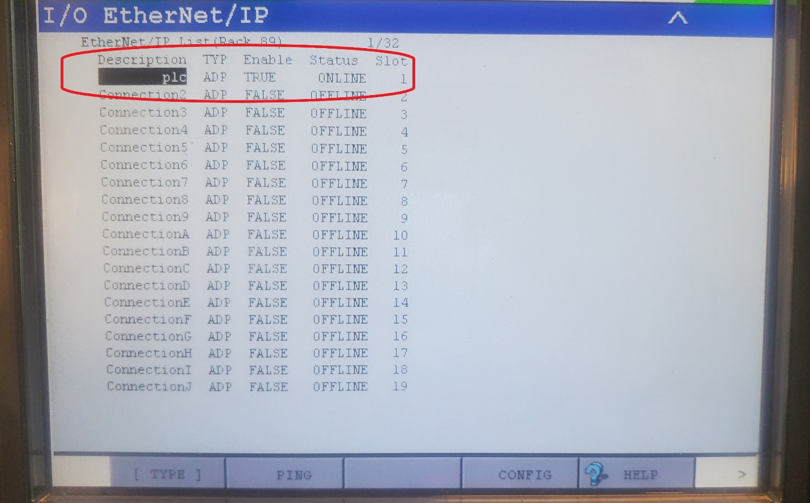

After you hit configuration, you should see the screen shown in Figure 13. This page is where you will input your word size for the inputs and outputs. Remember at the beginning of this section that one word as equal to 16bits. Note: for most adapters 4 words tends to be the default by most manufactures. For input size we will put 4 and for output size we will put 4 as well. Leave alarm severity set to WARN. Below this is Scanner IP. Currently it should look like what is seen in Figure 13. Once you have everything configured properly in the robot and Studio 5000 this will automatically populate with its IP address and other information.
Now with the configuration complete we can return to the previous page so hit PREV on the teach pendant. Once you are back on the screen of Figure 12 we can now change the Enable column. Navigate over to the Enable column and again CONFIG and HELP will change, but this time it will change to TRUE and FALSE. Press F4 to change it to true, once change you will also notice that status for slot 1 will change from offline to online. We can now move on to setting up the digital inputs / outputs for the robot.

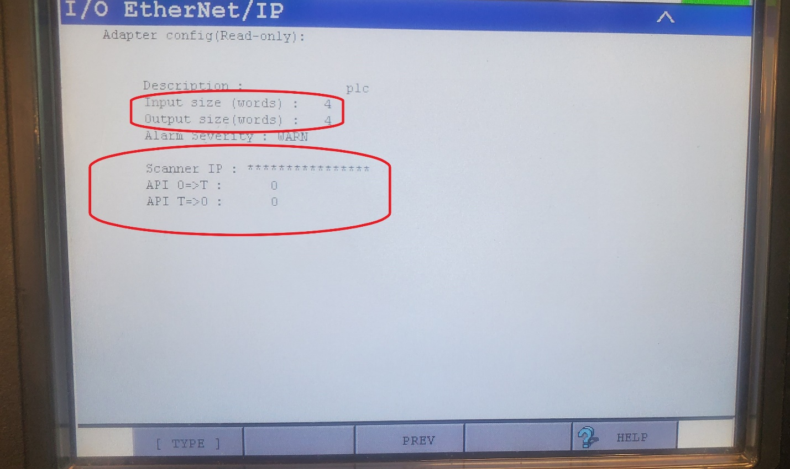

## 4. Digital Inputs/Outputs Config

Now we need to go through and sit up the digital inputs and outputs for the robot. Press the menu button to bring the menu and navigate to 5 I/O and the navigate to 3 Digital as seen in Figure 14.

Once you have selected 3 Digital It will bring up a screen as shown in Figure 15. This is the monitor page where you can see the status of DI/O and manually change the I/O’s on or off. Currently it is set to Inputs but if you want to see outputs you would go to IN/OUT at the bottom of Figure 15. for now, we are going to go to CONFIG to setup the inputs for the robots. So, tap CONFIG or press F2.

After you have pressed CONFIG or pressed F2 it will bring up a page as seen in Figure 16. Before we change anything on this page it’s important that we understand what each of these columns mean. First Range, this is where you set how many inputs and out puts you want each slot to control. This range is determined by the Word size we setup in step 3 adapter setup. Second is Rack, this is telling the robot what type of I/O you are running. For us we are running Rack 89 for ethernet I/O (See Table 3 for more Racks you can choose). Third is Slot, this Is the slot number we used back in step 3 adapter setup that you were told is extremely important to remember. Fourth is Start, start determines where you DI/O start in studio 5000. We will go over this more when we get to Studio 5000. Last is status, you will see four things here. UNASG, meaning nothing assigned. PEND, meaning pending changes and you need to restart the robot. ACTIV, Meaning DI/O are active. INVAL, meaning you have an invalid setup.

Let’s go ahead and set the inputs up, for range we want to set it to 1-64 as we have 4 Words (1 word = 16 bits) for our inputs. Next, we will setup the rack to 89 as this the Ethernet IP Rack. For slot put what slot you set your adapter up in in step 3 Adapter setup. For us we set up as Slot 1. By default, you want to start at bit 1 so leave this as 1 (if you have other DI/O already active in the robot for studio 5000 this is where you would change its starting bit). After you have made your changes, STAT should change to PEND (if you get INVAL go back and check the values you have put in). Let’s take care of the outputs before we restart the robot to make or changes take effect. To get to Outputs press F3 or tap IN/OUT.

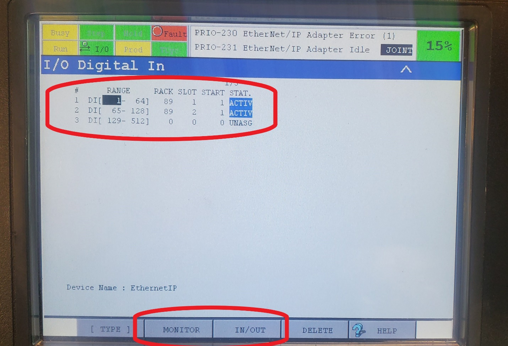

You should now see the outputs page as seen in Figure 17. The same steps we did for Inputs are what we are going to do for our outputs. Set the range 1-64 for our 4 Words we set for our Outputs. Set our Rack to 89 for Ethernet IP. Set our slot to 1 for adapter we setup in step 3 Adapter Setup. Last set our start to 1. Once we have all this put in you should again see STAT change to PEND. Now we can go ahead and restart the robot. After we have reset the robot lets make sure or Stat changed to ACTIV. So, navigate back to the configuration pages for both the Digital Inputs / Outputs for this step and make sure that you see ACTIV in STAT as Seen in both Figure 16 and Figure 17. With this we have finished the setup for the robot. Now we can move on to Studio 5000 and getting the PLC and Robot talking to each other the robot. Now we can move on to Studio 5000 and getting the PLC and Robot talking to each other.

## 5. Studio 5000 setup

with the robot setup we can move on to getting Studio 5000 setup. This instruction assumes that you have the basic understanding of studio 5000 and how to setup a PLC and a new project. This portion only goes over how to setup the robot as a new module for the PLC to control. First start up both RSLinx and Studio 5000 (we will only be making changes to Studio 5000 as RSLinx should be setup already for the PLC). Once you have studio 5000 up and have started a new project right click on A1/A2 ethernet and select new module. It should bring up a window with a bunch of modules you can choose from. We are looking for the Generic Ethernet Module as seen in Figure 18. Once you found the correct module select the module and press create.

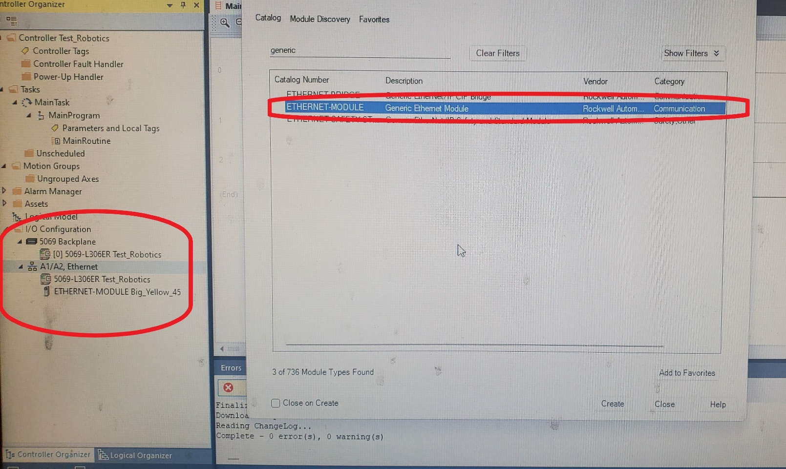

After you hit create it should bring up the module property page as seen in Figure 19. First let’s name or module so we know what the module is for. We named ours Big_Yellow_45 as this is the robot this module is connecting to.  Next, we need to set Comm format to Data – INT as the robot only handle data type INT (16bits) not DINTS (32bits). Now let’s put our IP address in, make sure IP Address is selected here and the input the IP address of the robot we created back in step 2 Controller Ethernet Setup. 

Now the hard part: I can’t tell you what assembly instances stance for but I can tell you how to determine what numbers you need. If we reference Table 4 and use the slot number that you should have memorized by now, we can determine what assembly numbers we need for input and output. Since we choose slot1 for our adapter we need 101 for Inputs and 151 for Outputs. Each of these are using 4 Words so for Size we place 4.  Configuration should be placed as 100 and 0 per Fanuc (not sure why). After you have inputted all the correct information hit apply and ok.

After you hit apply Studio 5000 will create controller tags for the robot. If you navigate to controller tags and open it up you should see those tags for the robot now. When you expand the tags for Inputs and Outputs as seen in Figure 20, you should see 4 Arrays (4 Words) of 16 bits (an INT). 

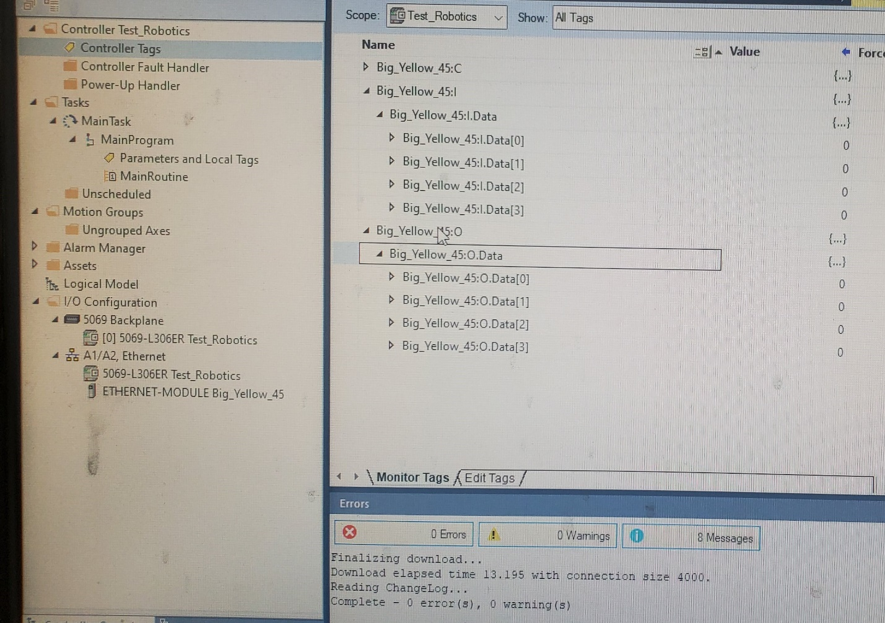

## 6. Verifying 

With everything finally setup let’s turn everything online and make sure everything is talking to each other. Go ahead and go to RSWho and select your controller and select download to turn online. Switch the controller to run mode and if you did everything correctly you should see the Status: Running under the properties for the ethernet module you made at the beginning of this step, see Figure 21.

If we go back to the robot controller and go back to the screen, we see in Figure 12 of step 3 Adapter Setup. We should now see the status for the slot we set the adapter in change from ONLINE to RUNNING, as seen in Figure 22.

One other thing you can check is to press config on you Ethernet adapter to bring up the page we see in Figure 13. Now that everything is running, we can see in Figure 23 that the Scanner IP has auto populated with the IP Address of the PLC we are using. 

**If you did not do things correctly** you will see Status: Faulted on the module in Studio 5000 (Figure 24) and the Status as ONLINE for the adapter (Figure 25). If you get these errors, I would recommend first checking your slot number and assembly instance numbers on Table 4. Also make sure you are using the correct IP Address for the robot in Studio 5000 and that the Comm Format is set to INT. By default, studio 5000 sets Comm Format to DINT and this can easily be overlooked.

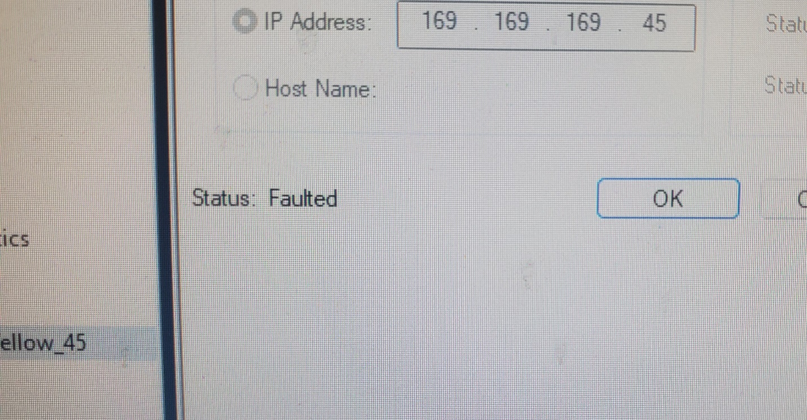

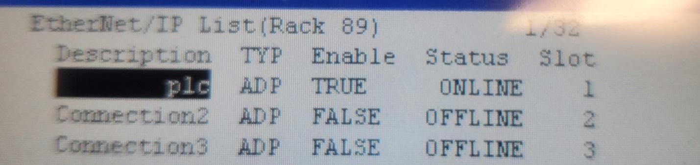

***

## FINAL RESULTS

Youtube Video...

