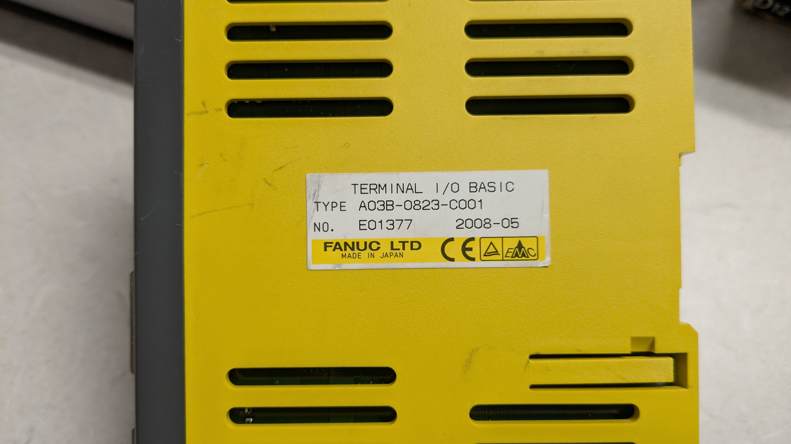
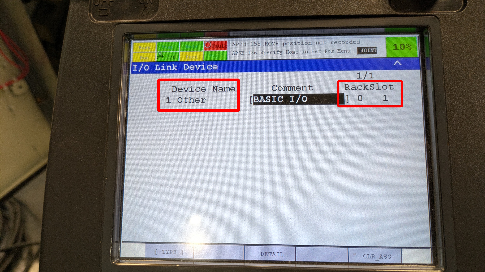
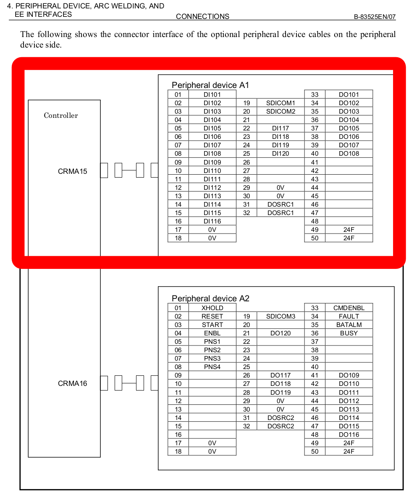

# DIGITAL I/O CONNECTIONS

## BASIC I/O FOR "BIG YELLA"

- Schematic

- JD1A/JD1B I/O LINKCable

- I/O LINK DEVICE page 1 recognizes as "Other" and gives a location of Rack 0 Slot 1
    - _I added the comment "BASIC I/O" manually_

- I/O LINK DEVICE page 2
    - _I added the "Points" manually_

***
***

## FANUC CERT CARTS

- CRMA58/CRMA59 Connectors

- CRMA58/CRMA59 Schematic

- CRMA15/CRMA16
    - These pins are likely to be in use already.
    - Best to leave them alone.

## BENCHIE

- R-J3iB has a different pinout

>Images to follow