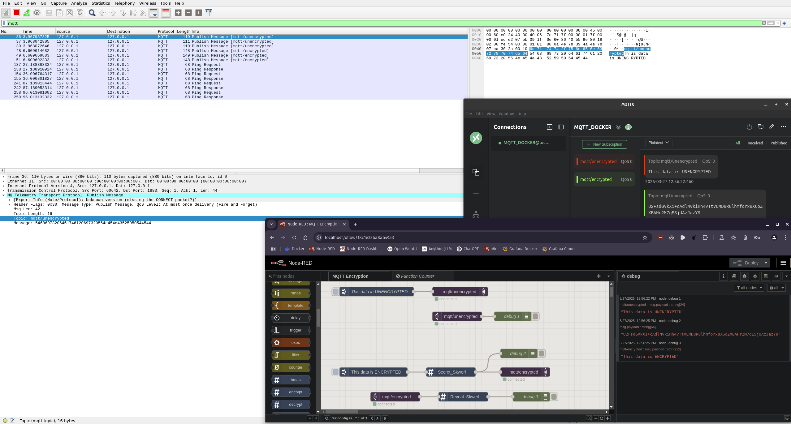
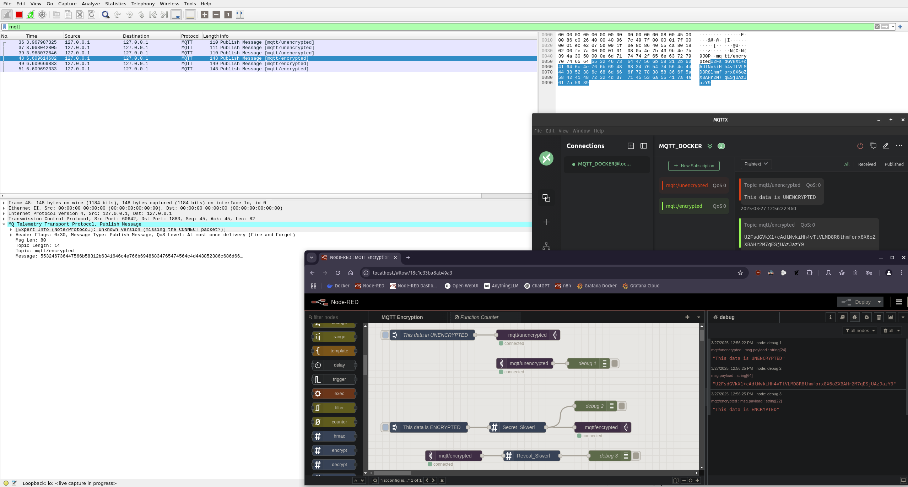

# MQTT ASSIGNMENT

## Perform the following tasks using the Command Line Interface (CLI) / Terminal:

- _ipconfig_ for addresses
- _getmac_ for MAC addresses
- _ping_ the local host

## Perform the following using two CLI windows:

- Publish a message to an MQTT topic
- Subscribe to the published topic/message

## Perform the following using MQTTX:

- Subscribe to the CLI published topic/message
- Publish a message to the CLI MQTT topic

