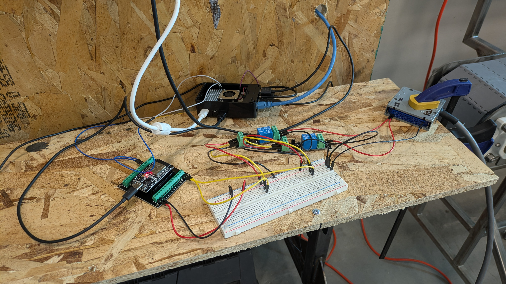

# MQTT + RELAYS on RPi

1. **WORKING SOLO**  
   Control relays locally by automating open/close operations using Raspberry Pi GPIO.

2. **WORKING IN PAIRS**  
   Control relays remotely by communicating with another Raspberry Pi on the same network using MQTT.

3. **WORKING AS A TEAM**  
   Coordinate all Raspberry Pi devices on the network to operate relays in a continuous sequence loop using MQTT.
   
   - The operational status of all relays must be displayed on the central Raspberry Pi hub using the dashboard UI.

