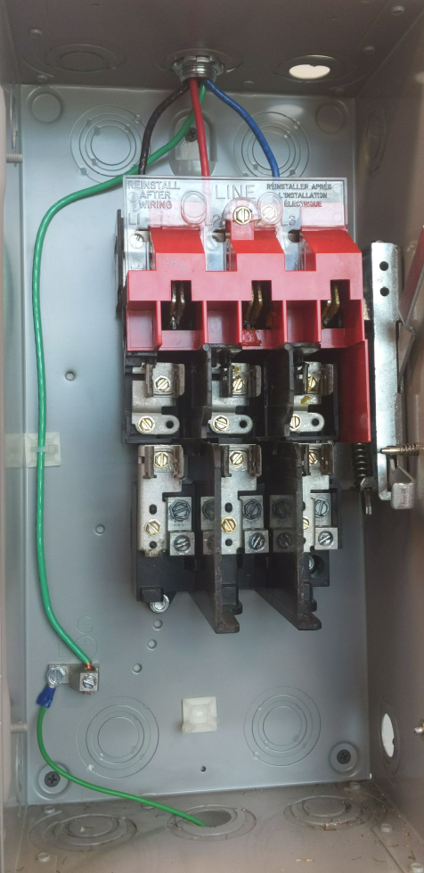
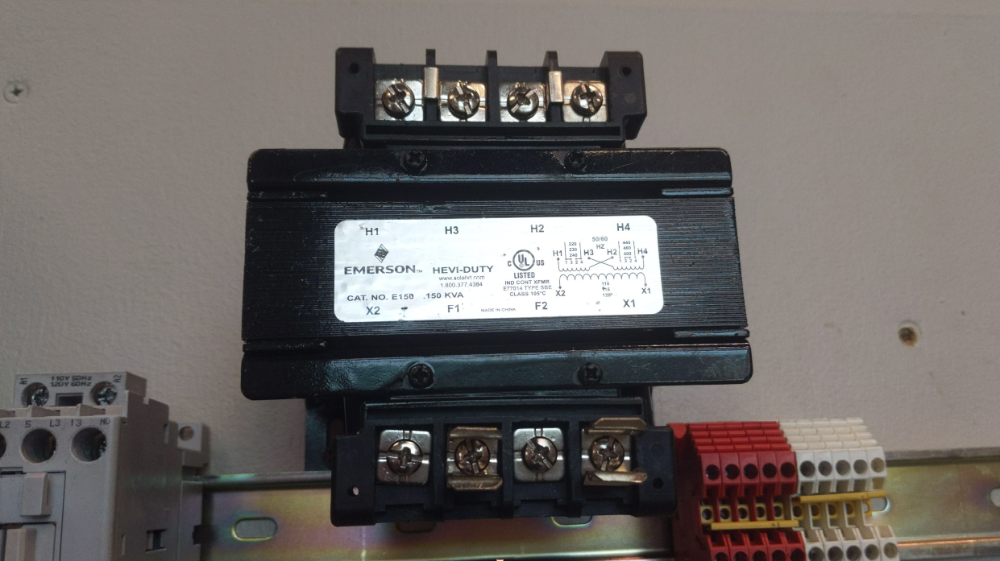

# TRANSFORMERS

Complete the following installation:
- Verify jumper bars are placed correctly on the inputs (primary) 
- Verify all fasteners are available and in good condition 
- Verify both fuse clips at X1 and F1 are installed and oriented correctly (secondary) 
- Properly install the FUSES into the FUSE CLIPS (X1-F1) 
- Properly install the FUSES into the MAIN POWER DISCONNECT box (L1, L2, L3) 


Record the following data:

- Identify the manufacturer and model number 
- Identify the min-max input voltage and output voltage range
- Record voltage readings from H1-H4 and F1-X2


Complete the following wiring task:
- Properly wire power between H1-H4 and the MAIN POWER DISCONNECT
- Properly wire a Pilot Light to the Transformer secondary windings

*Troubleshoot as needed

NOTE: X1-F1 is made via the FUSE


## LAB MAIN DISCONNECT




## LAB TRANSFORMER




## SIMPLE LADDER DIAGRAM

```text
F1            RED LIGHT            X2
|---------------( R )---------------|
```
