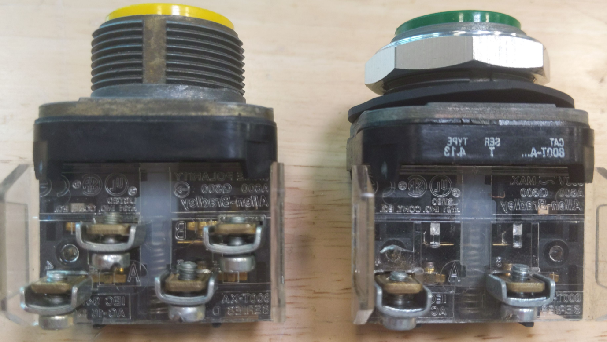

# SERIES WIRING

Complete the following tasks:
- Properly wire (SERIES) a N.C. and N.O. push-button from the TRANSFORMER secondary (X1-X2) 
- Properly wire a single PILOT LIGHT to the circuit 

*Troubleshoot as needed

NOTE: X1-F1 is made via the FUSE

## NC/NO Pushbutton and NO Pushbutton



## SIMPLE LADDER DIAGRAM

```text
F1           N.C.             N.O.             LIGHT          X2
|-----------[ / ]------------[   ]-------------( L )------------|
```
