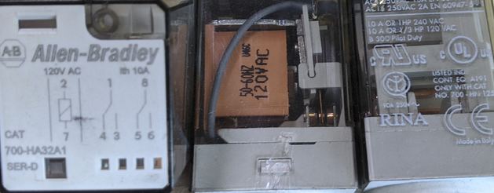

# RELAY AND SEAL-IN CIRCUIT

Complete the following tasks:
- Properly wire (1) N.O. and (1) N.C. Pushbutton
- Properly wire in (1) ICE-CUBE RELAY & BASE 
- Properly wire (2) LIGHTS to the RELAY contacts 

*Troubleshoot as needed

NOTE:
- X1-F1 is made via the FUSE
- See Sketch #3 for details.

UPGRADE:
- _What happens if we replace the AB ice cube relay with an AB TON timer relay?_

## Relays




## SIMPLE LADDER DIAGRAM

```text
F1     TB+	      NCPB          NOPB	      RELAY 1	         TB-	      X2
|-----[|||]------[ / ]---------[    ]---------( COIL )----------[|||]-----------|
	    |                |				  |				          |
        |                |  RELAY 1 NC#1  |                       |
        |                |-----[    ]-----|                       |
        |                                                         |
        |                                                         |
        |                                                         |
	    |	        RELAY 1 NC#2	             Red Light		  |
	    |--------------[ / ]-----------------------( R )----------|
	    |							                           	  |
	    |	        RELAY 1 NO#2	            Green Light		  |
	    |--------------[   ]-----------------------( G )----------|
```
