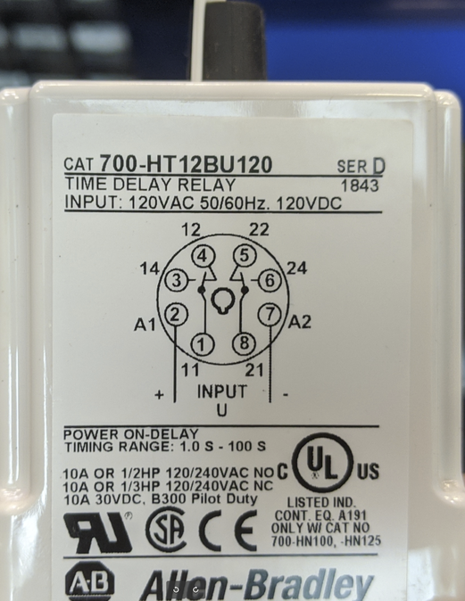

# TON TIMER AND SELECTOR SWITCH

Complete the following tasks:
- Properly wire (2) sets of TERMINAL BLOCKS to the TRANSFORMER secondary (X1/F1 - X2) 
- X1/F1 will act as the POSITIVE polarity (supply line)
    - X2 will act as the NEGATIVE polarity (return line) 
- Properly wire a SELECTOR SWITCH (SSW) from the (+) TERMINAL BLOCK 
- Properly wire in (1) TIME-ON (TON) TIMER RELAY & BASE 
- Properly wire (1) LIGHT to the N.C. contact 
- Properly wire (1) LIGHT to the N.O. contact 
    - Properly wire the returns to X2 via the (-) TERMINAL BLOCK 
- Properly install the FUSES into the MAIN POWER DISCONNECT box 

*Troubleshoot as needed

NOTE:
- X1-F1 is made via the FUSE
- See Sketch #16 for details.

CONSIDERATIONS:
- _What is the danger of using a SSW that locks into position vs. a "seal-in" circuit?_

## TON Timer Relay



## SIMPLE LADDER DIAGRAM

```text
F1     TB+	           SSW	               TON 1 Coil		     TB-	      X2
|-----[|||]-----------[    ]----------------( COIL )------------[|||]-----------|
	    |								                          |
	    |	        TON 1 N.C.	                 Red Light		  |
	    |--------------[ / ]-----------------------( R )----------|
	    |							                           	  |
	    |	        TON 1 N.O.	                Green Light		  |
	    |--------------[   ]-----------------------( G )----------|
```
