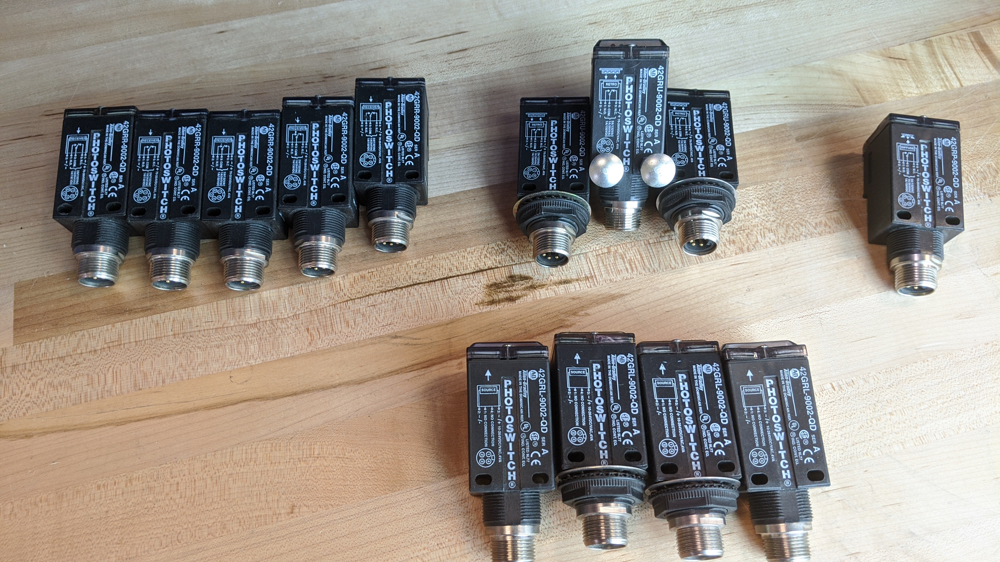

# PROXIMITY SENSOR

Complete the following tasks:

- Properly wire in a PROX SWITCH or PHOTO-EYE with N.C. and N.O. contacts 
- Properly wire (2) LIGHTS to the sensor's contacts 

*Troubleshoot as needed

NOTE:
- X1-F1 is made via the FUSE
- See Sketch #17 for details.


# Photoswitches



## SIMPLE LADDER DIAGRAM

```text
F1     TB+	                 PROX SW	                  TB-	       X2
|-----[|||]----------------( SENSOR )--------------------[|||]-----------|
	    |								                   |
	    |	        SENSOR N.C.	          Red Light		   |
	    |--------------[ / ]----------------( R )----------|
	    |							                       |
	    |	        SENSOR N.O.	          Green Light	   |
	    |--------------[   ]-----------------( G )---------|
```
